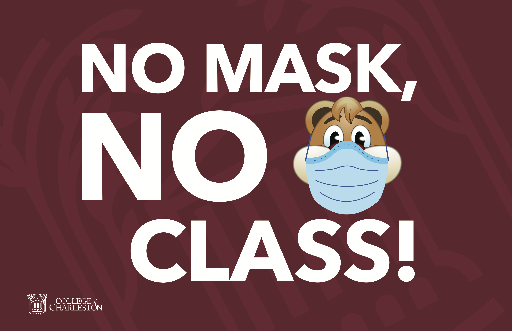

  
```{r setup, include=FALSE}
knitr::opts_chunk$set(warning = FALSE, message = FALSE, 
                      fig.retina = 3, fig.align = "center")
```

```{r xaringanExtra, echo=FALSE}
xaringanExtra::use_webcam()
```

.pull-left[
# Course Syllabus
<figure>
  
</figure>
]

.pull-right[

</br>
</br>
</br>
**POLI 211: Introduction to Public Policy**

**Spring 2022**

.light[Matthew Nowlin, PhD<br>
Department of Political Science<br>
College of Charleston
]

]

---

class: title title-1

# COVID-19 

.pull-left[
**It's not over** 

**Get vaccinated!**

**Masks must be worn in class at all times** 

**If you don't feel well, don't come to class**

**If you have been exposed to COVID-19, don't come to class** 
]

.pull-right[
</br>
<figure>
  
</figure>
]

---

class: center, middle

# Syllabus Stuff

---

class: title title-1

# The Syllabus 

**It's on OAKS (lms.cofc.edu)** 

**Content -> Course Information -> Syllabus** 

**Provides an overview of the course and includes required materials and assignments** 

**Readings and due dates may change**

**Be patient and be flexible** 

---

class: title title-1

# Your Professor 

.pull-left[
<figure>
  
</figure>
]

.pull-right[
- Dr. Matthew C. Nowlin 

- Email: [nowlinmc@cofc.edu](mailto:nowlinmc@cofc.edu)

- ~~Office~~ Student hours (Zoom only): Use the [Calendly link](https://calendly.com/nowlinmc/meetings) on the syllabus and on OAKS  

- **Public Policy Concentration** 

- **Environmental Policy Research Group** 
]


---

class: title title-1

# What is this course about? 

.pull-left[

</br>


> Our responsibility is one of decision --- for to govern is to choose 

> -- John F. Kennedy
]


.pull-right[
<figure>
<center>
  
</figure>
]

---

class: title title-1

# What is this course about? 

**As stated by President Kennedy, making choices is at the heart of governing. How do policymakers make choices regarding public policy? This course will address this question by examining the policymaking process in the United States.** 

--

How are problems defined and understood?  

How can problems be addressed? 

Who decides, and how? 

---

class: title title-1

# Course Goals and Learning Objectives

**The goals for this course are to**:

* Understand the public policy process in the US

* Apply various public policy models to real world policy issues

* Analyze the merits of public policy debates

* Analyze the merits of alternative policy solutions to public problems


---

class: title title-1

# Learning 

* This course will be _lecture_ and _discussion_ based 

--

* Do assigned readings prior to Tuesday's class 

--

* Be prepared to participate in class

--

* I may call on you to answer a question or discuss your policy issue 

--

* Laptops are allowed, but (not strongly) discouraged 

--

* Phones should only be out for answering quiz questions 

---

class: title title-1

# Required Materials

.pull-left[
* **Birkland** 5th Ed (4th is fine)

* **Poll Everywhere** (it's free!)

* Other required readings will be available on OAKS
]

.pull-right[
<center>

]

---

class: title title-1

# Course Requirements and Grading

**Assignments and Possible Points**  

* Quiz Questions: 200 points total 
* Mid-Term Exam (on OAKS): 100 points (**March 3**)
* Final Exam (on OAKS): 100 points (**May 2**)
* Issue Papers:  (4 at 100 pts each) 400 points total


---

class: title title-1

# Issue Papers

You will pick a problem or policy issue of interest to you and you will write **four** short, 4 to 5 page, papers about various aspects of the issue. Details for each issue paper are posted on OAKS under Content -> Issue Papers. 


* **Issue paper 1 DUE: Feb 3** 
* **Issue paper 2 DUE: Feb 24** 
* **Issue paper 3 DUE: March 24** 
* **Issue paper 4 DUE: April 21** 

---

class: title title-1

# Late Work Policy 

**Really only applies to issue papers** 

* 48-hour grace period: _can still turn in work with no late penalty_  

--

* After grace period, 10% deduction for each 24 hr period its late 

--

* After 72 hours beyond grace period, assignment will not be accepted 

---

class: title title-1

# Important Information 

**Make note of:** 

* **Honor Code and Academic Integrity** 
* **Students with Disabilities** 
* **Financial Challenges** 
* **Counseling Center** 
* **Center for Student Learning**
* **Religious Holiday Policy** 
* **Weather**

---

class: center, middle

# Quick Overview of Topics 

---

class: title title-1

# Course Overview 

.pull-left[
* Democracy and Public Policy
* The Context of Policymaking
* Policy Types
* Institutions
* Actors and Subsystems 
]

.pull-right[
* Policy stages
  * **Agenda Setting**
  * **Policy Formulation**
  * Decision-Making
  * Policy Analysis
  * **Policy Design**
  * **Policy Implementation** 
  * Public Budgeting
  * **Policy Evaluation**
]

---

class: title title-1

# For Next Time 

**Course Introduction** 

**Readings**: 

* **SKIM:** [Policy in 500 Words: what is public policy and why does it matter?](https://paulcairney.wordpress.com/2016/04/28/policy-in-500-words-what-is-public-policy-and-why-does-it-matter/)
* **SKIM:** Birkland, Chapter 1  


