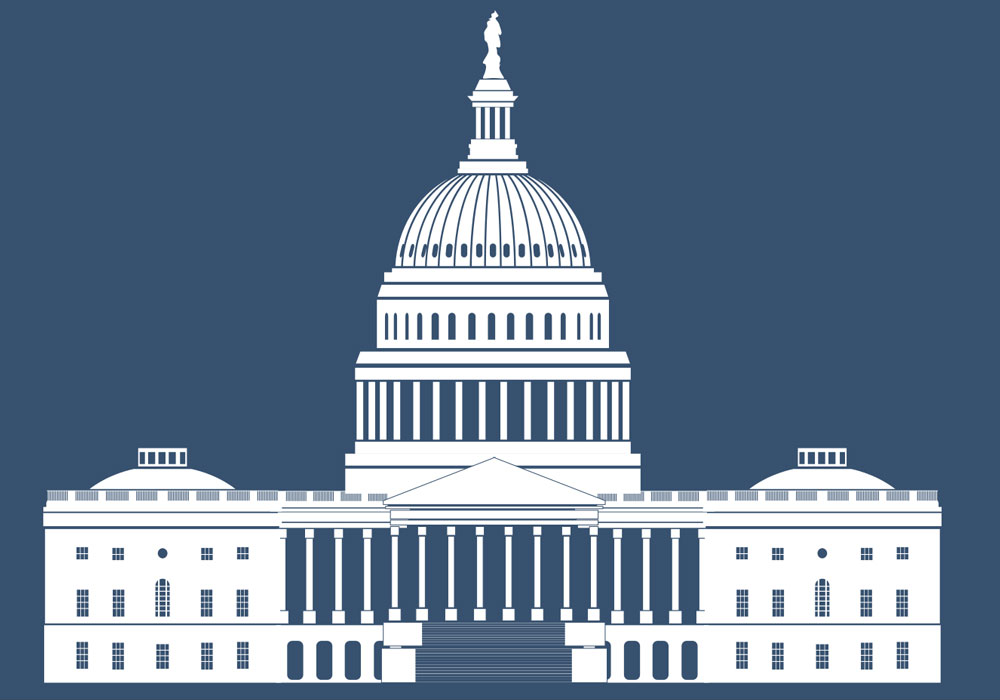

  
```{r setup, include=FALSE}
knitr::opts_chunk$set(warning = FALSE, message = FALSE, 
                      fig.retina = 3, fig.align = "center")
```

```{r xaringanExtra, echo=FALSE}
xaringanExtra::use_webcam()
```

.pull-left[
# Course Introduction and Overview
<figure>
  
</figure>
]

.pull-right[

</br>
</br>
</br>
**POLI 211: Introduction to Public Policy**

**Summer 2021**

.light[Matthew Nowlin, PhD<br>
Department of Political Science<br>
College of Charleston
]

]

---

class: title title-1

# The Syllabus 

**It's on OAKS (lms.cofc.edu)** 

**Content -> Course Information -> POLI 211 Syllabus** 

**Provides an overview of the course and includes required materials and assignments** 

**Specific required readings and assignments for each module will be listed on OAKS** 

---

class: title title-1

# Your Professor 

.pull-left[
<figure>
  
</figure>
]

.pull-right[
- Dr. Matthew C. Nowlin 

- Email: [nowlinmc@cofc.edu](mailto:nowlinmc@cofc.edu)

- Meetings: Use the [Calendly link](https://calendly.com/nowlinmc/meetings) on the syllabus and on OAKS  

- **Public Policy Concentration** 

- **Environmental Policy Research Group** 
]


---

class: title title-1

# What is this course about? 

.pull-left[
<figure>
<center>
  
</figure>
]

.pull-right[

</br>
</br>


> Our responsibility is one of decision --- for to govern is to choose 

> -- John F. Kennedy
]

---

class: title title-1

# What is this course about? 

**As stated by President Kennedy, making choices is at the heart of governing. How do policymakers make choices regarding public policy? This course will address this question by examining the policymaking process in the United States.** 

--

How are problems defined and understood?  

How can problems be addressed? 

Who decides, and how? 

---

class: title title-1

# Course Goals and Learning Objectives

**The goals for this course are to**:

* Understand the public policy process in the US

* Apply various public policy models to real world policy issues

* Analyze the merits of public policy debates

* Analyze the merits of alternative policy solutions to public problems


---

class: title title-1

# Required Materials

.pull-left[
<center>

]

.pull-right[
Access to [OAKS](https://lms.cofc.edu/d2l/login). We will make extensive use of OAKS in this course and several of its tools including Discussion Boards, Quizzes, and Assignments. 
]


---

class: title title-1

# Navigating This Course 

Course material will be organized into 4 content modules that you will be able to access on OAKS beginning each **Tuesday** starting on **Tuesday, July 13**. Each module will consist of:

.pull-left[
* Readings from the Birkland text 
* Course lectures
* Module quiz 
  * 10 questions in 10 minutes
]

.pull-right[
* Policy issue (Democracy, Healthcare, Police reform, Immigration):
  * Reading 
	* Video 
	* Discussion board 
]

---

class: title title-1

# Navigating This Course 

* Two exams (4 short essay questions): 
	* Exam I, July 26
	* Exam II, August 10

* Research presentation 
  * Instructions posted on OAKS


