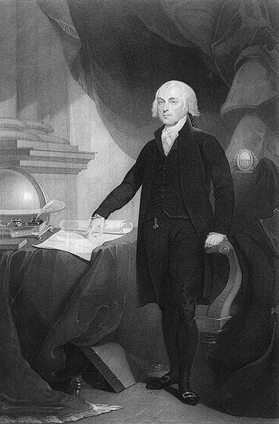
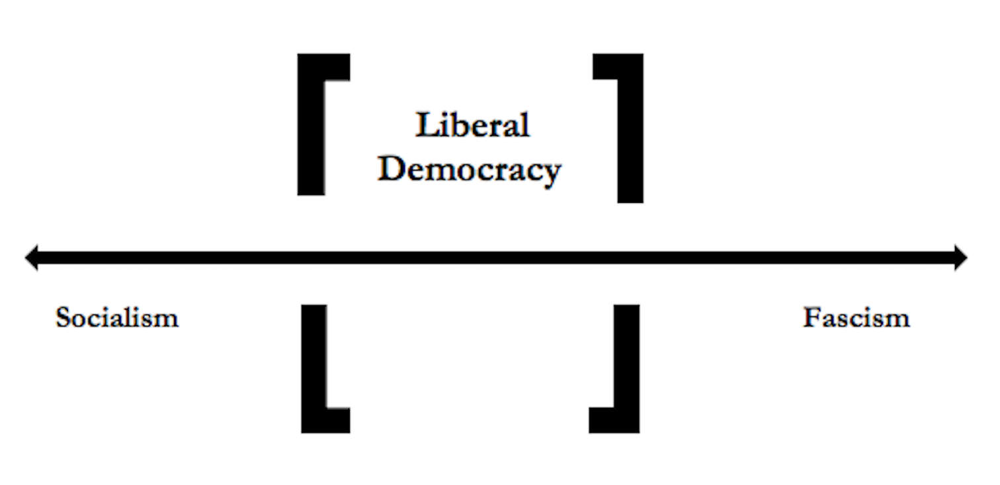
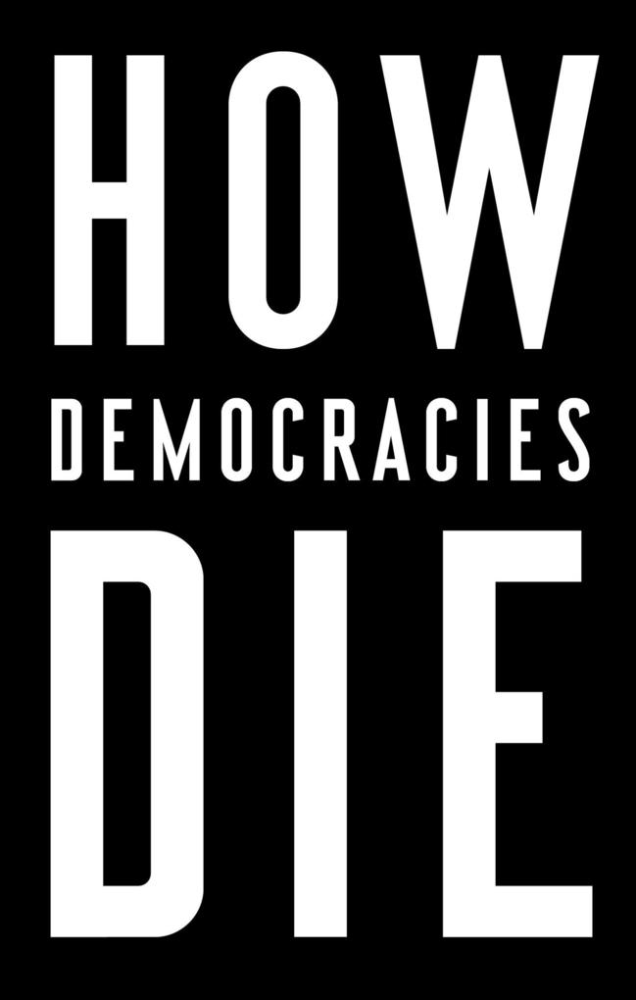

  
```{r setup, include=FALSE}
knitr::opts_chunk$set(warning = FALSE, message = FALSE, 
                      fig.retina = 3, fig.align = "center")
```

```{r xaringanExtra, echo=FALSE}
xaringanExtra::use_webcam()
```

.pull-left[
# Democracy and Public Policy
<figure>
  
</figure>
]

.pull-right[

</br>
</br>
</br>
**POLI 211: Introduction to Public Policy**

**Spring 2022**

.light[Matthew Nowlin, PhD<br>
Department of Political Science<br>
College of Charleston
]

]

???
announcements:
download readings if they don't open 

get ready for poll everywhere practice on Wed 

be respectful 

---

class: center, middle

# What is public policy? 

---

class: title title-1

# Public Policy

* Policy responds to a _problem_ 

* The policy is made on the "public’s" behalf

* Policies have goals 

* Policies are made by governments

* Policies are implemented by public and private actors

* Policy can be action or _inaction_ 

* Policy allocates values 

???
**These definitions share the following**:  

---

class: title title-1

# Public Policy

> **A statement by government of what it intends to do, such as a law, regulation, ruling, decision, order; or a combination of these. The lack of such statements may also be an implicit statement of a policy not to do something** 

.footnote[-*Birkland*, pg 6]


---

class: title title-1

# Public Policy 

_A statement by government of what it intends to do_ 

**_Cairney_**: the sum total of _government action_, from signals of intent to the final outcomes

--

* Who decides what "government action" should be? 

* How do they decide? 

--

**What system of government do we have?** 

---

class: center, middle

# Short answer: Democracy, but ...

---

class: title title-1

# Democracy

**Is the US a Republic or a Democracy?**

--

**Madison in Federalist 10** 

.pull-left[
**a pure democracy**: small number of citizens ... adminster government in person

**a republic**: a government in which the scheme of representation takes place
]


.pull-right[
<figure>
<center>
  
</figure>
]

???
note that this info comes from Hans Noel lecture 

claiming that the US is a republic is often used as a way to discourage reforms to make the system more democratic 

---

class: title title-1

# Democracy

**Is the US a Republic or a Democracy?** 

**Republic**: Latin - _res_ (entity, concern) + _publicus_ ('of the people', public )
* No monarch; Authority from the people 

--

**Democracy**: Greek - _demos_ ('the people') + _kratia_ (power, rule)
* The people rule
* _Majority rule, minority rights_ 


???
kratia - kray-sha

---

class: title title-1

# Democracy

**Is the US a Republic or a Democracy?** 

**Constitutional**: Constrained by agreed-upon rules 

--

**Representative**: Made up of _delegates_ and _trustees_ 


--

**But...** 

.pull-left[
How is authority arranged? 

How do the people rule? When? 
]

.pull-right[
What type of constraints? Who chooses?

How are representatives selected? 
]

---

class: title title-1

# Democracy 

|**Republic and Democracy**|
| :---: | 

 |  | **Democracy** | **Not a Democracy** | 
 | :---           | :---                 |
|**Republic** | The United States | People's Republic of China 
| | South Korea  | North Korea 
| | Germany | Cuba
| | | |
| **Not a Republic** | The United Kingdom | Saudi Arabia
| | Canada | Oman
| | Australia | Qatar 

---

class: title title-1

# What is Democracy? 

> **A system of government with regular, free and fair elections, in which all adult citizens have the right to vote and possess basic civil liberties such as freedom of speech and association**

.footnote[-_Levitsky_ and _Ziblatt_, pg. 6]

---

class: title title-1

# What is Democracy? 


**One _elementary principle_ of democracy** 

> _That all members [of a polity] are to be treated (under the constitution) as if they were equally qualified to participate in the process of making decisions about the policies [the polity] will pursue_


.footnote[-_Dahl_, pg. 37]

---

class: title title-1

# What is Democracy? 

**Criteria for a democratic process** 

--

* Effective participation 

--

* Equality in voting 

--

* Gaining enlightened understanding 

--

* Exercising final control over the agenda 

--

* Inclusion of adults 

???

Effective participation: all members must have _equal and effective opportunities_  to make their views known 

Equality in voting: all members must have an _equal and effective opportunity_ to vote and all votes must be counted as equal 

Gaining enlightened understanding: _equal and effective opportunities_  for learning about relevant alternative policies and their likely consequences 

Exercising final control over the agenda: members must have the exclusive opportunity to decide how and, if they choose, what matter will be placed on the agenda 

Inclusion of adults: all (or at least most) adult permanent residents should have the full rights of citizens that are implied by the first four criteria 

---

class: title title-1

# Why Democracy? 

**Democracy produces desirable consequences** 

--

.pull-left[
* Avoiding tyranny
* Essential rights
* General freedom 
* Self determination 
* Moral autonomy
]


--


.pull-right[
* Human development
* Protecting essential personal interests 
* Political equality 
* Peace-seeking
* Prosperity 
]

---

<iframe src="https://embed.polleverywhere.com/multiple_choice_polls/gfkzsoQL7vebLPqO13NPL?controls=none&short_poll=true" width="800px" height="600px"></iframe>

---

class: title title-1

# Other Forms of Government 

**Socialism**: the means of production, distribution, and exchange are owned or regulated by the community as a whole
* **Communism**: as practiced has meant control by one central government 

---

class: title title-1

# Other Forms of Government 

**Fascism**: led by a dictator having complete power, forcibly suppressing opposition and criticism, regimenting all industry, commerce, etc., and emphasizing an aggressive nationalism and often racism
* **Autocratic**: a _person_ that rules with unlimited authority 

---

class: title title-1

# Other Forms of Government 

**Authoritarian**: central government that maintains power through repression and exclusion of challengers
* _Authoritarian equilibrium rests mainly on lies, fear, and economic prosperity_ 

--

**Competitive Authoritarianism**: hold elections but ensure that they are fundamentally unfair

---

class: title title-1

# The Vital Center

<figure>
<center>
  
</figure>


---

class: title title-1

# Democratic Backsliding 

.pull-left[
**Weakening of norms** 

**Mutual toleration**: competing parties accept one another as legitimate rivals

**Forbearance**: exercise restraint in deploying their institutional prerogatives 
] 

.pull-right[
<figure>
<center>
  
</figure>
]

<!-- show _Preserving Democracy: https://www.pbs.org/show/preserving-democracy-pursuing-more-perfect-union/-->

