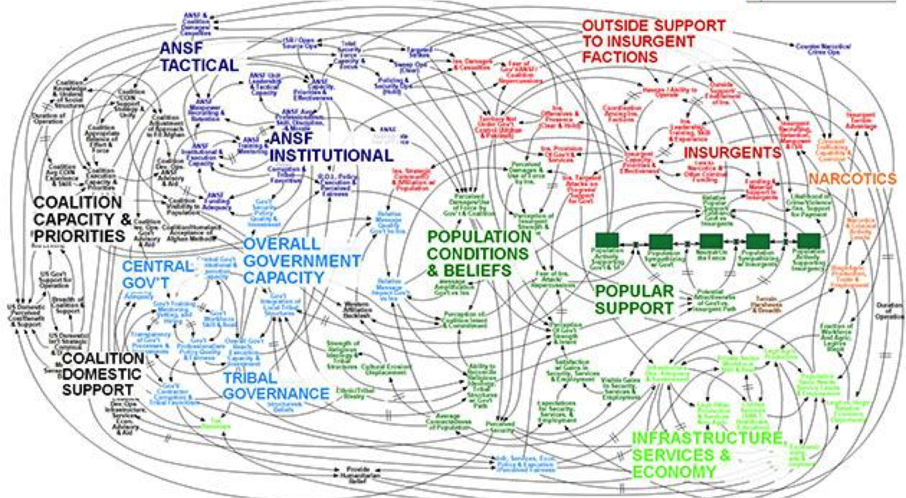
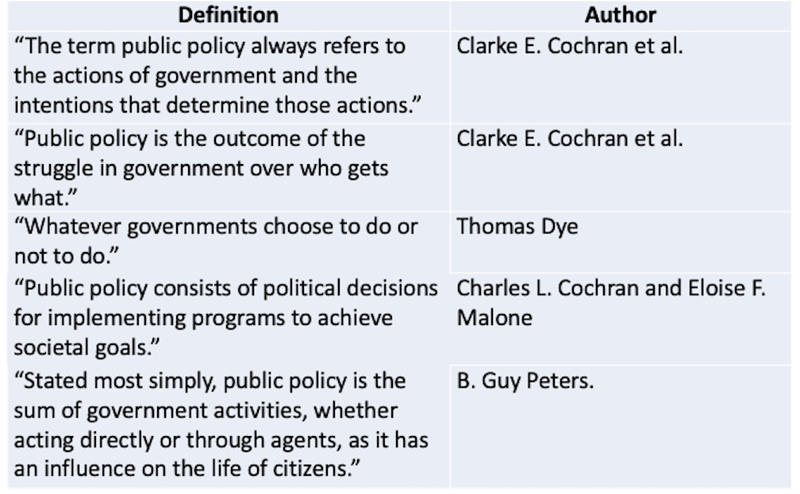

  
```{r setup, include=FALSE}
knitr::opts_chunk$set(warning = FALSE, message = FALSE, 
                      fig.retina = 3, fig.align = "center")
```

```{r xaringanExtra, echo=FALSE}
xaringanExtra::use_webcam()
```

.pull-left[
# Democracy and Public Policy
<figure>
  
</figure>
]

.pull-right[

</br>
</br>
</br>
**POLI 211: Introduction to Public Policy**

**Fall 2021**

.light[Matthew Nowlin, PhD<br>
Department of Political Science<br>
College of Charleston
]

]

???
announcements:
download readings if they don't open 

get ready for poll everywhere practice on Wed 

be respectful 

---

class: center, middle

# What is the biggest _problem_ facing the United States? 

---

class: title title-1

# Problems 

**What makes something a "problem"?** 

--

_What private troubles warrant definition as public problems and thereby legitimately raise claims for remedy with public resources?_ 

--

**Problems vs. Conditions** 

--

**Problems**: something can be done to address it 

--

**Conditions**: nothing can be done to address it; _it's just the way it is_ 

---

class: center, middle

# How do we address problems? 

---

class: title title-1

# Public Policy 

--

**What is public policy?** 

--

**_Cairney_**: the sum total of _government action_, from signals of intent to the final outcomes

--

* Who decides what "government action" should be? 

* How do they decide? 

--

* **What system of government do we have?** 

---

class: center, middle

# Short answer: Democracy, but ...

---

class: title title-1

# Democracy

**Is the US a Republic or a Democracy?**

--

**Madison in Federalist 10** 

.pull-left[
**a pure democracy**: small number of citizens ... adminster government in person

**a republic**: a government in which the scheme of representation takes place
]


.pull-right[
<figure>
<center>
  
</figure>
]

???
note that this info comes from Hans Noel lecture 

claiming that the US is a republic is often used as a way to discourage reforms to make the system more democratic 

---

class: title title-1

# Democracy

**Is the US a Republic or a Democracy?** 

**Republic**: Latin - _res_ (entity, concern) + _publicus_ ('of the people', public )
* No monarch; Authority from the people 

--

**Democracy**: Greek - _demos_ ('the people') + _kratia_ (power, rule)
* The people rule  


???
kratia - kray-sha

---

class: title title-1

# Democracy

**Is the US a Republic or a Democracy?** 

**Constitutional**: Constrained by agreed-upon rules 

--

**Representative**: Made up of delegates and trustees 


--

**But...** 

.pull-left[
How is authority arranged? 

How do the people rule? When? 
]

.pull-right[
What type of constraints? Who chooses?

How are representatives selected? 
]

---

class: title title-1

# Democracy 

|**Republic and Democracy**|
| :---: | 

 |  | **Democracy** | **Not a Democracy** | 
 | :---           | :---                 |
|**Republic** | The United States | People's Republic of China 
| | South Korea  | North Korea 
| | Germany | Cuba
| | | |
| **Not a Republic** | The United Kingdom | Saudi Arabia
| | Canada | Oman
| | Australia | Qatar 

---

class: title title-1

# What is Democracy? 

_A system of government with regular, free and fair elections, in which all adult citizens have the right to vote and possess basic civil liberties such as freedom of speech and association_ 

.footnote[-_Levitsky_ and _Ziblatt_, pg. 6]

---

class: title title-1

# What is Democracy? 


**One _elementary principle_ of democracy** 

_That all members [of a polity] are to be treated (under the constitution) as if they were equally qualified to participate in the process of making decisions about the policies [the polity] will pursue_


.footnote[-_Dahl_, pg. 37]

---

class: title title-1

# What is Democracy? 

**Criteria for a democratic process** 

--

* Effective participation 

--

* Equality in voting 

--

* Gaining enlightened understanding 

--

* Exercising final control over the agenda 

--

* Inclusion of adults 

???

Effective participation: all members must have _equal and effective opportunities_  to make their views known 

Equality in voting: all members must have an _equal and effective opportunity_ to vote and all votes must be counted as equal 

Gaining enlightened understanding: _equal and effective opportunities_  for learning about relevant alternative policies and their likely consequences 

Exercising final control over the agenda: members must have the exclusive opportunity to decide how and, if they choose, what matter will be placed on the agenda 

Inclusion of adults: all (or at least most) adult permanent residents should have the full rights of citizens that are implied by the first four criteria 

---

class: title title-1

# Why Democracy? 

**Democracy produces desirable consequences** 

--

.pull-left[
* Avoiding tyranny
* Essential rights
* General freedom 
* Self determination 
* Moral autonomy
]


--


.pull-right[
* Human development
* Protecting essential personal interests 
* Political equality 
* Peace-seeking
* Prosperity 
]

---

class: title title-1

# Other Forms of Government 

**Socialism**: the means of production, distribution, and exchange should be owned or regulated by the community as a whole
* **Communism**: control by one central government 

--

**Fascism**: led by a dictator having complete power, forcibly suppressing opposition and criticism, regimenting all industry, commerce, etc., and emphasizing an aggressive nationalism and often racism
* **Autocratic**: a person has rules with unlimited authority 

---

class: title title-1

# Other Forms of Government 

**Authoritarian**: central government that maintains power through repression and exclusion of challengers
* _Authoritarian equilibrium rests mainly on lies, fear, and economic prosperity_ 

--

**Competitive Authoritarianism**: hold elections but ensure that they are fundamentally unfair


---

class: title title-1

# Democratic Backsliding 

.pull-left[
**Weakening of norms** 

**Mutual toleration**: competing parties accept one another as legitimate rivals

**Forbearance**: exercise restraint in deploying their institutional prerogatives 
] 

.pull-right[
<figure>
<center>
  
</figure>
]

---

<center> 
<iframe src="https://embed.polleverywhere.com/multiple_choice_polls/ObpV6XGV7UYpaiGkqbn3z?controls=none&short_poll=true" width="800px" height="600px"></iframe>

---

class: center, middle

# What is public policy and how do we study it?

---

class: title title-1

# Public Policy 

**What is public policy?** 

**_Cairney_**: the sum total of _government action_, from signals of intent to the final outcomes

--

* Does ‘government action’ include what policymakers say they will do as well as what they actually do?

--

* Does it include the effects of a decision as well as the decision itself? 

---

class: title title-1

# Public Policy 

**What is public policy?** 

**_Cairney_**: the sum total of government action, from signals of intent to the final outcomes

* What is ‘the government’ and does it include elected and unelected policymakers?

--

* Does public policy include what policymakers do _not_ do?  

---

class: title title-1

# Complexity

**Afghanistan Stability/COIN Dynamics – Security**

<center>


???
_When we understand that slide, we'll have won the war_ -General Stanley 
McChrystal 

complex problems and complex process of policymaking 

---

class: title title-1

# Hard to Define 

<figure>
<center>
  
</figure>

---

class: title title-1

# Public Policy

--

* Policy responds to a _problem_ 

--

* The policy is made on the "public’s" behalf

--

* Policies have goals 

--

* Policies are made by governments

--

* Policies are implemented by public and private actors

--

* Policy can be action or _inaction_ 

--

* Policy allocates values 

???
**These definitions share the following**:  

---

class: title title-1

# Public Policy


</br> 

## A statement by government of what it intends to do, such as a law, regulation, ruling, decision, order; or a combination of these. The lack of such statements may also be an implicit statement of a policy not to do something 

-*Birkland*, pg 6

---

class: title title-1

# Forms of Public Policy

--

**Public policy can take different forms** 

* The _form_ of policy is based on the institution 

--

**Forms and institutions include**: 
.pull-left[
* Laws (legislation): Congress  
* Regulations: Executive branch agencies 
]

.pull-right[
* Executive orders: The president 
* Court decisions: The courts 
]


---

class: title title-1

# Politics 

--

**"Who gets what, when, and how"** (_Lasswell_)

--

**Dictionary definitions**: 
  * "the art or science of government"
  
  * "political activities characterized by artful and often dishonest practices" 
    * This dictionary defines artful as "skillful" or "wily" 

--

**Policy choices are made through a political process**

---

<iframe src="https://embed.polleverywhere.com/multiple_choice_polls/r3eeWh9ryddd78Vi1YoBP?controls=none&short_poll=true" width="800px" height="600px"></iframe>

---

class: title title-1

# For Next Week  

**Yes, we are here on Labor Day** 

**The Context of Policymaking**

* _Readings_:
    * Birkland, Chapter 2
    * Birkland, Chapter 3

**Be prepared to answer some quiz questions**

