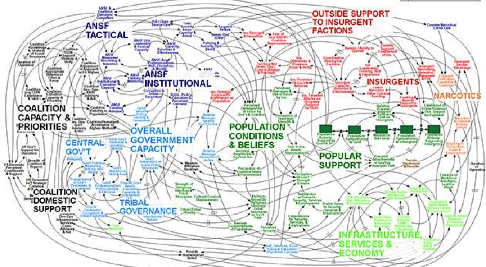

```{r setup, include=FALSE}
knitr::opts_chunk$set(warning = FALSE, message = FALSE, 
                      fig.retina = 3, fig.align = "center")
```

```{r xaringanExtra, echo=FALSE}
xaringanExtra::use_webcam()
```

.pull-left[
# Course Introduction

<figure>
  
</figure>
]

.pull-right[

</br>
</br>
</br>
**POLI 211: Introduction to Public Policy**

**Spring 2022**

.light[Matthew Nowlin, PhD<br>
Department of Political Science<br>
College of Charleston
]

]

---

class: title title-1

# COVID-19 

.pull-left[
**It's not over** 

**Get vaccinated! (including booster)**

**Masks must be worn _properly_ in class at all times** 

**If you don't feel well, don't come to class**
]

.pull-right[
</br>
<figure>
  
</figure>
]

---

class: title title-1

# The Syllabus 

**It's on OAKS (lms.cofc.edu)** 

**Content -> Course Information -> Syllabus** 

**Provides an overview of the course and includes required materials and assignments** 

**Changes will be announced in class, through email, and on OAKS** 

---

class: title title-1

# Your Professor 

.pull-left[
<figure>
  
</figure>
]

.pull-right[
- Dr. Matthew C. Nowlin 

- Email: [nowlinmc@cofc.edu](mailto:nowlinmc@cofc.edu)

- ~~Office~~ Student hours (Zoom only): Use the [Calendly link](https://calendly.com/nowlinmc/meetings) on the syllabus and on OAKS under _Meet with Me_  

]


---

class: title title-1

# What is this course about? 

.pull-left[

</br>


> Our responsibility is one of decision --- for to govern is to choose 

> -- John F. Kennedy
]


.pull-right[
<figure>
<center>
  
</figure>
]

---

class: title title-1

# What is this course about? 

**As stated by President Kennedy, making choices is at the heart of governing. How do policymakers make choices regarding public policy? This course will address this question by examining the policymaking process in the United States.** 

--

How are problems defined and understood?  

How can problems be addressed? 

Who decides, and how? 

---

class: title title-1

# Required Materials

.pull-left[
* **Birkland** 5th Ed (4th is fine)

* **Poll Everywhere** (it's free!)

* Other required readings will be available on OAKS
]

.pull-right[
<center>

]

---

class: center, middle

# Course Introduction

---

class: center, middle

# What is the biggest _problem_ facing the United States? 

---

class: title title-1

# Problems 

**What makes something a "problem"?** 

--

_What private troubles warrant definition as public problems and thereby legitimately raise claims for remedy with public resources?_ 

--

**Problems vs. Conditions** 

--

**Problems**: something can be done to address it 

--

**Conditions**: nothing can be done to address it; _it's just the way it is_ 

---

class: center, middle

# How do we address problems? 

---

class: center, middle

# What is public policy and how do we study it?

---

class: title title-1

# Public Policy 

**What is public policy?** 

**_Cairney_**: the sum total of _government action_, from signals of intent to the final outcomes

--

* Does ‘government action’ include what policymakers say they will do as well as what they actually do?

--

* Does it include the effects of a decision as well as the decision itself? 

---

class: title title-1

# Public Policy 

**What is public policy?** 

**_Cairney_**: the sum total of government action, from signals of intent to the final outcomes

* What is ‘the government’ and does it include elected and unelected policymakers?

--

* Does public policy include what policymakers do _not_ do?  

---

class: title title-1

# Complexity

**Afghanistan Stability/COIN Dynamics – Security**

<center>


???
_When we understand that slide, we'll have won the war_ -General Stanley 
McChrystal 

complex problems and complex process of policymaking 

---

class: title title-1

# Hard to Define 

<figure>
<center>
  
</figure>

---

class: title title-1

# Public Policy

--

* Policy responds to a _problem_ 

--

* The policy is made on the "public’s" behalf

--

* Policies have goals 

--

* Policies are made by governments

--

* Policies are implemented by public and private actors

--

* Policy can be action or _inaction_ 

--

* Policy allocates values 

???
**These definitions share the following**:  

---

class: title title-1

# Public Policy

> **A statement by government of what it intends to do, such as a law, regulation, ruling, decision, order; or a combination of these. The lack of such statements may also be an implicit statement of a policy not to do something** 

-*Birkland*, pg 6

---

class: title title-1

# Forms of Public Policy

--

**Public policy can take different forms** 

* The _form_ of policy is based on the institution 

--

**Forms and institutions include**: 
.pull-left[
* Laws (legislation): Congress  
* Regulations: Executive branch agencies 
]

.pull-right[
* Executive orders: The president 
* Court decisions: The courts 
]


---

class: title title-1

# Politics 

--

**"Who gets what, when, and how"** (_Lasswell_)

--

**Dictionary definitions**: 
  * "the art or science of government"
  
  * "political activities characterized by artful and often dishonest practices" 
    * This dictionary defines artful as "skillful" or "wily" 

--

**Policy choices are made through a political process**

---

class: title title-1

# Course Overview 

.pull-left[
* Democracy and Public Policy
* The Context of Policymaking
* Policy Types
* Institutions
* Actors and Subsystems 
]

.pull-right[
* Policy stages
  * **Agenda Setting**
  * **Policy Formulation**
  * Decision-Making
  * Policy Analysis
  * **Policy Design**
  * **Policy Implementation** 
  * Public Budgeting
  * **Policy Evaluation**
]

---

class: title title-1

# For Next Time 

**Democracy and Public Policy** 

**Readings**: 

* Dahl, Chapter 4: _What is Democracy?_, on [OAKS](https://lms.cofc.edu)
* Dahl, Chapter 5: _Why Democracy?_, on [OAKS](https://lms.cofc.edu)
* Levitsky and Ziblatt, Chapter 1: _How Democracies Die: Introduction_, on [OAKS](https://lms.cofc.edu)


  