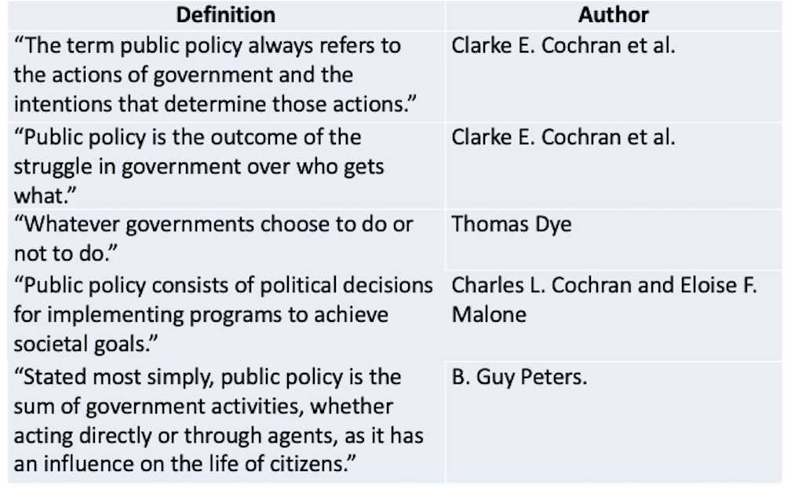

  
```{r setup, include=FALSE}
knitr::opts_chunk$set(warning = FALSE, message = FALSE, 
                      fig.retina = 3, fig.align = "center")
```

```{r xaringanExtra, echo=FALSE}
xaringanExtra::use_webcam()
```

.pull-left[
# Public <br> Policy
<figure>
  
</figure>
]

.pull-right[

</br>
</br>
</br>
**POLI 211: Introduction to Public Policy**

**Summer 2021**

.light[Matthew Nowlin, PhD<br>
Department of Political Science<br>
College of Charleston
]

]

---

class: center, middle

# What is public policy?

---

class: title title-1

# Defining Public Policy

<figure>
<center>
  
</figure>

---

class: title title-1

# Defining Public Policy

**These definitions share**:   

* Policy responds to a _problem_ 

* The policy is made on the "public’s" behalf

* Policies have goals 

* Policies are made by governments

* Policies are implemented by public and private actors

* Policy can be action or _inaction_ 

---

class: title title-1

# Defining Public Policy

**A statement by government of what it intends to do, such as a law, regulation, ruling, decision, order, or a combination of these. The lack of such statements may also be an implicit statement of a policy not to do something.** 

--

Addresses a **problem** 

--

**Problem**: A usually undesirable situation that, according to people or interest groups, can be alleviated by _government action_. 

--

_Problems_ vs. _Conditions_  

---

class: title title-1

# Form of Policies 

> Policies are revealed through texts, practices, symbols, and discourses that define and deliver values including goods and services as well as regulations, income, status, and other positively or negatively valued attributes. 

> -- Schneider and Ingram

.pull-left[
* Laws (legislation)
* Court decisions
]

.pull-right[
* Regulations
* Executive orders 
]

---

class: title title-1

# Politics? 

**Lasswell: "Who gets what, when, and how"** 

--

Dictionary definitions: 
* "the art or science of government" 
* "political activities characterized by artful and often dishonest practices" 

--

**Policy choices are made through a political process** 

