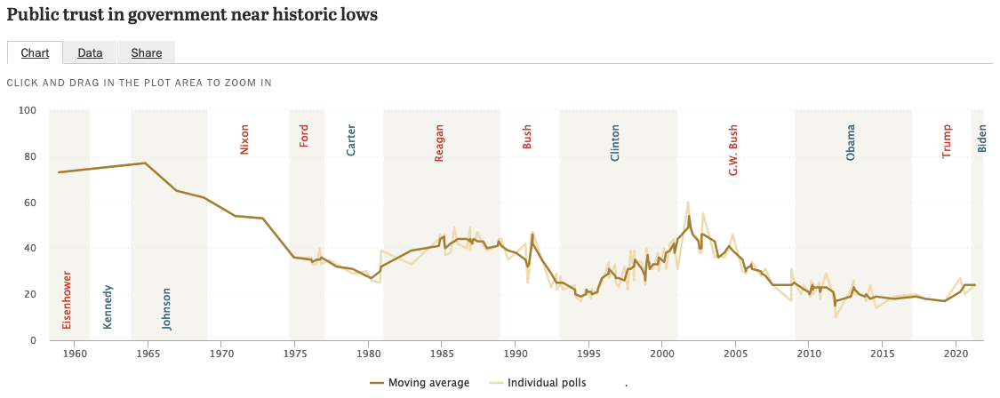

  
```{r setup, include=FALSE}
knitr::opts_chunk$set(warning = FALSE, message = FALSE, 
                      fig.retina = 3, fig.align = "center")
```

```{r xaringanExtra, echo=FALSE}
xaringanExtra::use_webcam()
```

.pull-left[
# The Context of Policymaking
<figure>
  
</figure>
]

.pull-right[

</br>
</br>
</br>
**POLI 211: Introduction to Public Policy**

**Fall 2021**

.light[Matthew Nowlin, PhD<br>
Department of Political Science<br>
College of Charleston
]

]

???
announcements:
be ready for quiz questions

---

class: title title-1

# Defining Public Policy

## A statement by government of what it intends to do, such as a law, regulation, ruling, decision, order; or a combination of these. The lack of such statements may also be an implicit statement of a policy not to do something 

-*Birkland*, pg 6

---

class: title title-1

# Understanding Public Policy 

**The Policy Stages** 

<figure>
  
</figure>

---

class: title title-1

# Understanding Public Policy 

**The Policymaking System** 

<figure>
<center>
  
</figure>

---

class: title title-1

# The Policymaking System

.pull-left[

**The Policy Environment** 
* Social
* Political
* Economic 
* Structural 
]

.pull-right[
</br>
<figure>
  
</figure>
]

---

class: title title-1

# The Policymaking System

.pull-left[

**Inputs** 

_Demands for policy_
* Election results 
* Public opinion 
* Communication
* Interest groups 
* Media
]

.pull-right[
</br>
<figure>
  
</figure>
]

---

class: title title-1

# The Policymaking System

.pull-left[

**Outputs** 

_Different forms of policy_ 
* Legislation (**statute law**)
* Court decisions (**case law**)
* Regulations 
]

.pull-right[
</br>
<figure>
  
</figure>
]

---

class: title title-1

# The Policymaking System

.pull-left[

**The Political System**
* "Black box"
* Input-output model 
]

.pull-right[
</br>
<figure>
  
</figure>
]

---

class: title title-1

# The Policymaking System

.pull-left[

**Feedback**

_Changes that result from policy choices feedback into the system and as inputs_ 
]

.pull-right[
</br>
<figure>
  
</figure>
]

---


<iframe src="https://embed.polleverywhere.com/multiple_choice_polls/4lHWeHjYm84a0XCClODot?controls=none&short_poll=true" width="800px" height="600px"></iframe>

???
democracy quiz question

---

class: title title-1

# The Social Environment 

**A growing, but aging, population** 

* The population is aging
* The birth rate is declining 

--

**An increasingly diverse population** 

* The United States is becoming more racially and ethnically diverse

---

class: title title-1

# The Social Environment 

**Changes in the labor force** 

* More working women
  * More working women in professional positions
  * More women attending college than men

--

* Single women earn less than single men

--

* Dual-income families earn the most

---

class: title title-1

# The Social Environment 

**Shecession and the COVID-19 pandemic** 

<figure>
<center>
  
</figure>

---

class: center, middle

# What are the implications of the social environment for public policy?

---

<iframe src="https://embed.polleverywhere.com/multiple_choice_polls/nJezsvTgfPrJb8tyjJaFT?controls=none&short_poll=true" width="800px" height="600px"></iframe>


???
quiz question
---

class: title title-1

# The Political Environment

**Polarization**
* _Divergent views along ideological and/or partisan lines_

--

**Asymmetric polarization** 
* The parties are fundamentally different 

--

* _Democrats_ are a coalition of groups making demands on government 

--

* _Republicans_ are ideologically homogeneous 

???
talk about issue papers 
---

class: title title-1

# Polarization 

<figure>
<center>
  
</figure>

---

class: title title-1

# Asymmetric Polarization

<figure>
<center>
  
</figure>

---

class: title title-1

# Asymmetric Polarization

<figure>
<center>
  
</figure>

---

<iframe src="https://embed.polleverywhere.com/multiple_choice_polls/hwDof18s0ltSUEoDwkqtz?controls=none&short_poll=true" width="800px" height="600px"></iframe>

???
demographics quiz question
---

class: title title-1

# The Political Environment 

**Public opinion** 

--

* What does the public care about? What are some of the most important problems? 

--

* Does public opinion impact policymaking? If so, how?

--

* How polarized is the public?

---

class: title title-1

# The Political Environment 

**The _Policy Mood_ of the public** 

<figure>
<center>
  
</figure>

---

class: title title-1

# The Political Environment 

<figure>
<center>
  
</figure>

???
implications for policy?

---

class: title title-1

# The Economic Environment

**Gross Domestic Product (GDP)**

--

* Economic growth is a main national goal

--

* There are major debates over how to promote economic growth

--

* Keynesian notions of stimulus are often controversial
    * They may stimulate spending and growth …
    * at the expense of creating larger deficits and debt

--

* Deficit and debt

---

class: title title-1

# The Economic Environment 

<figure>
  
</figure>

???
recession: negative GDP growth for two successive quarters 
---

class: title title-1

# The Economic Environment 

<figure>
  
</figure>

---

class: title title-1

# The Economic Environment 

<figure>
  
</figure>

---

<iframe src="https://embed.polleverywhere.com/multiple_choice_polls/azJpw7hqbgrEguLumC5Jk?controls=none&short_poll=true" width="800px" height="600px"></iframe>

???
quiz question 
---

class: center, middle 

# The Structural Environment 

---

class: title title-1

# Is the US a Republic or a Democracy? 

.pull-left[
**Republic**

**Democracy** 
]

.pull-right[
**Constitutional**

**Representative**
]

--

**But...** 

How is authority arranged? 

How do the people rule? When? 

What type of constraints? Who chooses?

How are representatives selected? 

---

class: title title-1

# Constitutional Order 

</br>

<center>
 

---

class: title title-1

# Constitutional Order

**_We the people_ are sovereign**

--

* The Constitution constrains _government_, not the people

--

* The constitutional order changes to address inequities and problems
  * The understanding of an indivisible union
  * Treatment of African Americans and women
  * Treatment of unpopular minorities
        

---

class: title title-1

# Constitutional Order

**One of the major features of our constitutional order is policy restraint**  

--

**Federalism**: A system of government in which power is shared between a central or federal government and other governments, such as states or provinces. 

--

**Separation of powers**: The constitutional division of powers among the legislative, executive, and judicial branches of government
* _Separate branches, sharing power_ 


---

class: title title-1

# Separation of Power 

<br>

| Congress | President | Courts 
--- | --- | --- | --- 
**Legislative** | **make laws** | recommend laws, veto, regulations | review laws  
**Executive** | override vetos, oversight | **enforce and implement laws** | review executive acts 
**Judicial** | advise and consent | pardon, nominate judges | **interpret laws** 


---

class: title title-1

# Constitutional Order

**Cultural commitments** 

--

* Personal liberty

--

* The sanctity of property

--

* The rule of law

--

* Civil rights
  * Speech
  * Association 
  * Expression 

---

<iframe src="https://embed.polleverywhere.com/multiple_choice_polls/Zqs3FL6elgmGCzNteDQky?controls=none&short_poll=true" width="800px" height="600px"></iframe>

???
quiz question 
---

class: center, middle 

# Historical Developments 

---

class: title title-1

# Historical Eras of Policy

**Divided Power: 1789–1870**

**State Activism: 1870s–1936**

**National Activism: 1936–1960**

**National Standards: 1961–1980?**

**The End of Big Government: 1980–?**

---

class: title title-1

# Divided Power: 1789–1870 

--

.pull-left[
**Much responsibility was with state government**
* The nation was rural
* Sparsely populated and homogeneous
* Limited federal government
* Valued individual liberty and private property
* Not much industry yet
]

--

.pull-right[
**There were greater demands on government when**
* The nation urbanized
* Population grew
* The Civil War required strong national action
]

---

class: title title-1

# State Activism: 1870s–1936

**Demands of the Industrial Revolution**

--

* Social strife due to industrialization
 * The birth of the labor movement
 
--

* Perceived abuses of business and the drive to regulate it
  * Anti-trust
  * Workplace safety

--

**Progressive Era: 1890s - 1920s**

---

class: title title-1

# State Activism: 1870–1936

**Policy achievements**

--

.pull-left[
* The Civil War Amendments
    * 13th, 14th, and 15th amendments 
    * The _incorporation doctrine_ 

* The Civil Rights Acts of 1866 and 1875
]


.pull-right[
* Creation of the Interstate Commerce Commission
* The Pure Food and Drug Act
* Creation of the Federal Reserve 
* Business regulation at the state and federal levels
]

---

class: title title-1

# State Activism: 1870–1936

**Less successful than it might have been** 

--

* The 1876 election 
    * Ended Reconstruction 

--

* _Plessy v. Ferguson_ (1896)

--

* _Laissez-faire economics_
  * _Lochner v. New York_ (1905)

---

class: title title-1

# National Activism: 1936–1960  

**The great depression and demands for action**

--

* Some early parts of the _New Deal_ were struck down by the courts 
    * Court packing 
    * _The switch in time that saved nine_ 

--

* The depression and WW II eras provided a basis for active federal government
    * Demobilization and the G.I. Bill
    * The postwar economic boom
    * Cold War and remobilization
    
---

class: title title-1

# National Standards: 1961–1980

--

* The reinvigoration of national activism in the 1960s
    * Johnson’s “Great Society” Programs	
    * These were changed to “standards”

--

* Continued activity in federal policy making
    * Creation of the EPA and environmental laws
    * Wage and price controls
    * Energy policy

---

class: title title-1

# National Standards: 1960–1980

* Considerable power was returned to the states
    * Nixon’s “New Federalism”
    * The reassertion of congressional power after 1974

---

class: center, middle

## _Government cannot solve our problems, it can't set our goals. It cannot define our vision. Government cannot eliminate poverty or provide a bountiful economy or reduce inflation or save our cities or cure illiteracy or provide energy. And government cannot mandate goodness._

---

class: center, middle

 

---

class: center, middle

## _We know big government does not have all the answers. We know there's not program for every problem. We have worked to give the American people a smaller, less bureaucratic government in Washington. And we have to give the American people one that lives within its means. The era of big government is over._ 

---

class: center, middle

 

---

class: title title-1

# The End of “Big Government”? 

--

* Deregulation of airlines, trucking

--

* Greater concerns with deficits and debts 

--

* How do we define “too big”?

???
spending; regulation 
---

class: title title-1

# Trust in Government 

<figure>
  
</figure>

---

class: title title-1

# Policymaking Tends Toward Stability 

--

**Ideological and political stability**

--

**Fragmentation**

--

**Basic rules and norms**

--

**Open government and policy restraint**


---

class: title title-1

# Policymaking Tends Toward Stability 


.pull-left[
## Will it remain stable? 


]

.pull-right[
<figure>
  
  
</figure>
]


