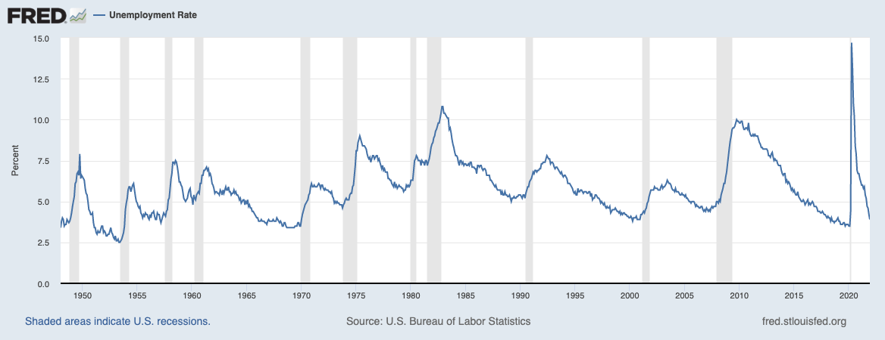

  
```{r setup, include=FALSE}
knitr::opts_chunk$set(warning = FALSE, message = FALSE, 
                      fig.retina = 3, fig.align = "center")
```

```{r xaringanExtra, echo=FALSE}
xaringanExtra::use_webcam()
```

.pull-left[
# The Context of Policymaking
<figure>
  
</figure>
]

.pull-right[

</br>
</br>
</br>
**POLI 211: Introduction to Public Policy**

**Fall 2021**

.light[Matthew Nowlin, PhD<br>
Department of Political Science<br>
College of Charleston
]

]

???
announcements:
be ready for quiz questions

---

class: title title-1

# Defining Public Policy

</br> 

## A statement by government of what it intends to do, such as a law, regulation, ruling, decision, order; or a combination of these. The lack of such statements may also be an implicit statement of a policy not to do something 

-*Birkland*, pg 6

---

class: title title-1

# Understanding Public Policy 

**The Policy Stages** 

<figure>
  
</figure>

---

class: title title-1

# Understanding Public Policy 

**The Policymaking System** 

<figure>
<center>
  
</figure>

---

class: title title-1

# The Policymaking System

.pull-left[

**The Policy Environment** 
* _Structural_ 
* Social
* Political
* Economic 
]

.pull-right[
</br>
<figure>
  
</figure>
]

---

class: title title-1

# The Policymaking System

.pull-left[

**Inputs** 
* _Demands for policy_
* Election results 
* Public opinion 
* Communication
* Interest groups 
* Media
]

.pull-right[
</br>
<figure>
  
</figure>
]

---

class: title title-1

# The Policymaking System

.pull-left[

**Outputs** 
* _Different forms of policy_ 
* Legislation (**statute law**)
* Court decisions (**case law**)
* Regulations 
]

.pull-right[
</br>
<figure>
  
</figure>
]

---

class: title title-1

# The Policymaking System

.pull-left[

**The Political System**
* "Black box"
* Input-output model 
]

.pull-right[
</br>
<figure>
  
</figure>
]

---

class: title title-1

# The Policymaking System

.pull-left[

**Feedback**

_Changes that result from policy choices feedback into the system and as inputs_ 
]

.pull-right[
</br>
<figure>
  
</figure>
]

---


???
democracy quiz question

---

class: title title-1

# The Social Environment 

**A growing, but aging, population** 

* The population is aging
* The birth rate is declining 

--

**An increasingly diverse population** 

* The United States is becoming more racially and ethnically diverse

---

class: title title-1

# The Social Environment 

**Changes in the labor force** 

* More working women
    * More working women in professional positions
    * More women attending college than men

* Single women earn less than single men

* Dual-income families earn the most

---

class: title title-1

# The Social Environment 

**Shecession and the COVID-19 pandemic** 

<figure>
<center>
  
</figure>

---

class: center, middle

# What are the implications of the social environment for public policy?

---


???
quiz question
---

class: title title-1

# The Political Environment

**Polarization**
* _Divergent views along ideological and/or partisan lines_

--

**Asymmetric polarization** 
* The parties are fundamentally different 

--

* _Democrats_ are a coalition of groups making demands on government 

--

* _Republicans_ are ideologically homogeneous 

---

class: title title-1

# Polarization 

<figure>
<center>
  
</figure>

---

class: title title-1

# Asymmetric Polarization

<figure>
<center>
  
</figure>

---

class: title title-1

# Asymmetric Polarization

<figure>
<center>
  
</figure>

---

class: title title-1

# The Political Environment 

**Public opinion** 

--

* What does the public care about? What are some of the most important problems? 

--

* Does public opinion impact policymaking? If so, how?

--

* How polarized is the public?

---

class: title title-1

# The Political Environment 

**The _Policy Mood_ of the public** 

<figure>
<center>
  
</figure>

---

class: title title-1

# The Political Environment 

<figure>
<center>
  
</figure>

???
implications for policy?

---

???
quiz question

---

class: title title-1

# The Economic Environment

**Gross Domestic Product (GDP)**

--

* Economic growth is a main national goal

--

* There are major debates over how to promote economic growth

--

* Keynesian notions of stimulus are often controversial
    * They may stimulate spending and growth …
    * at the expense of creating larger deficits and debt

--

* Deficit and debt

---

class: title title-1

# The Economic Environment 

<figure>
  
</figure>

???
recession: negative GDP growth for two successive quarters 
---

class: title title-1

# The Economic Environment 

<figure>
  
</figure>

---

class: title title-1

# The Economic Environment 

<figure>
  
</figure>

---

class: center, middle 

# The Structural Environment 


