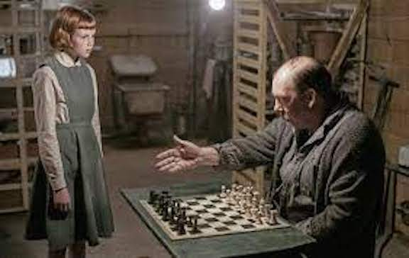
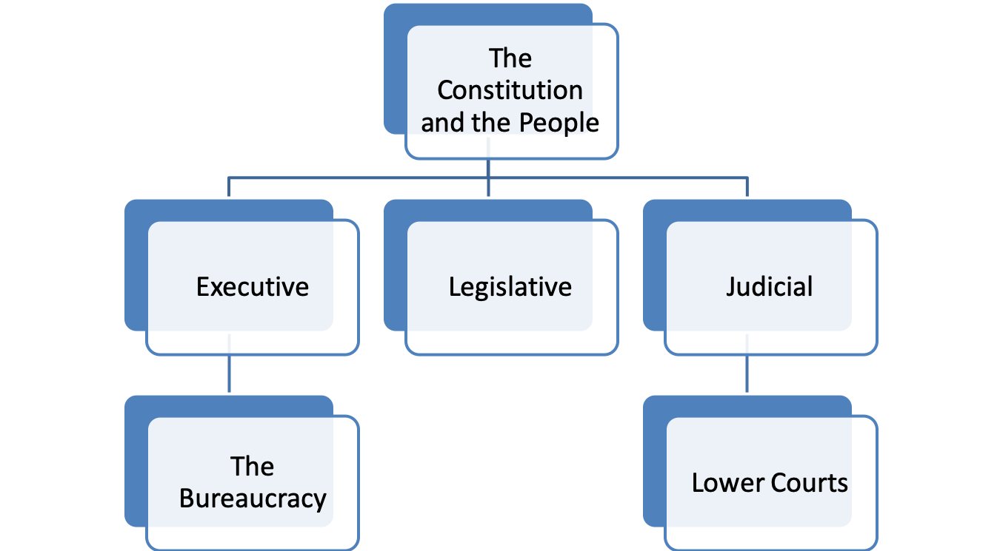
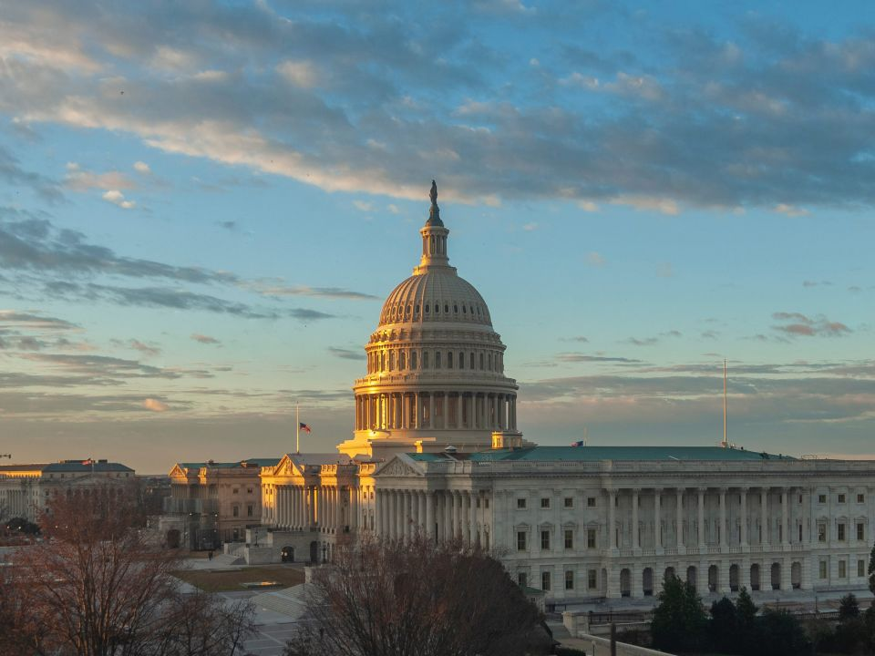
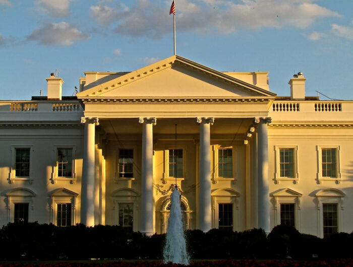
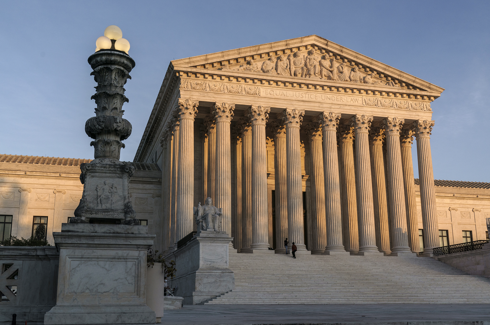

  
```{r setup, include=FALSE}
knitr::opts_chunk$set(warning = FALSE, message = FALSE, 
                      fig.retina = 3, fig.align = "center")
```

```{r xaringanExtra, echo=FALSE}
xaringanExtra::use_webcam()
```

.pull-left[
# Policy Actors and <br> Institutions 
<figure>
  
</figure>
]

.pull-right[

</br>
</br>
</br>
**POLI 211: Introduction to Public Policy**

**Summer 2021**

.light[Matthew Nowlin, PhD<br>
Department of Political Science<br>
College of Charleston
]

]

---

class: title title-1

# Actors and Institutions 

**Official** Actors

* _A participant in the policy process whose involvement is motivated or mandated by his or her official position in a government agency or office_ 

* **Actors within government** 
    
---

class: title title-1

# Actors and Institutions 

**Unofficial** Actors 
* _A participant in the policy process who does not have constitutionally or legally created incentives or mandates to be a part of the process_  

* **Actors outside government** 

---

class: title title-1 

# Actors and Institutions 

**Institutions** 
  * _Organizations as well as systems in which individuals interact and achieve political and policy goals through explicit or implicit rules that evolve over time through cooperative means_

--

.pull-left[
**Rules of the game** 
* _How decisions get made_ 
]

.pull-right[
<figure>
<center>
  
</figure>
]

---

class: title title-1

# Hierarchical Authority

<figure>
<center>
  
</figure>


---

class: title title-1

# Official Actors 

.pull-left[
**Legislative branch** 
  * Make laws
  * Hold hearings
  * Perform oversight over the executive branch
  * Do casework for constituents
]

.pull-right[
</br>
<figure>
  
</figure>
]

---

class: title title-1

# Official Actors 

.pull-left[
**Executive branch**
* President 
  * Veto power
  * _Go public_ 

* Agencies and bureaucrats 
  * Bureaucratic discretion 
  * Rules and regulations 
]

.pull-right[
</br>
<figure>
  
</figure>
]

---

class: title title-1

# Official Actors 

.pull-left[
**Judicial branch**  
* Judicial review 
]

.pull-right[
</br>
<figure>
  
</figure>
]


---

class: title title-1

# Unofficial Actors 

**Individual citizens**
* Low engagement 

--

**Interest groups**
* _A collection of people or organizations that unite to advance their desired political outcomes in government and society_  
* **Activities**: lobby, support candidates, mobilize members, sue in court, protests 

---

class: title title-1

# Unofficial Actors 

**Political parties** 
* Aggregate preferences and connect elected officials and the public

--

**Think tanks and research groups** 
* Provide information 

--

**News media** 
* Serve as _watchdog_ on government 

