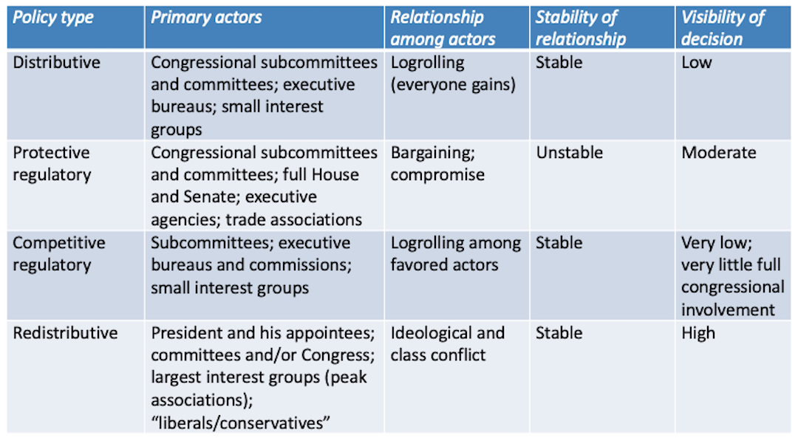
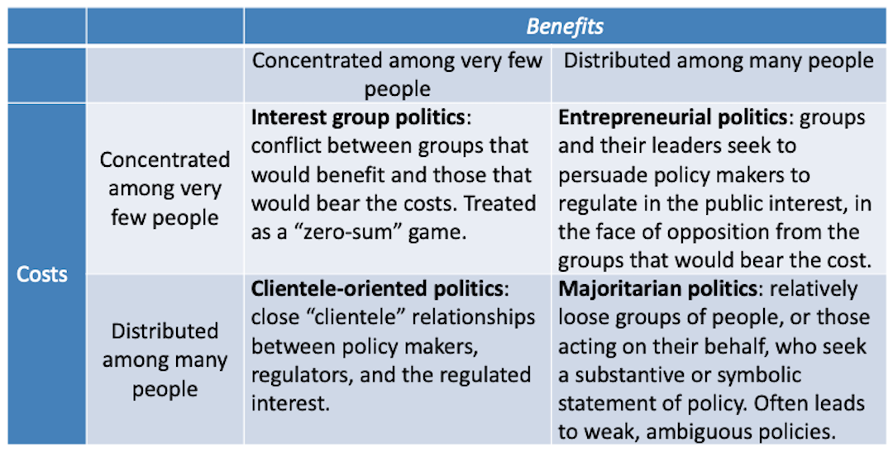

  
```{r setup, include=FALSE}
knitr::opts_chunk$set(warning = FALSE, message = FALSE, 
                      fig.retina = 3, fig.align = "center")
```

.pull-left[
# Policy <br> Types
<figure>
  
</figure>
]

.pull-right[

</br>
</br>
</br>
**POLI 211: Introduction to Public Policy**

**Spring 2022**

.light[Matthew Nowlin, PhD<br>
Department of Political Science<br>
College of Charleston
]

]

---

class: title title-1

# Policy Types 

**A way to categorize policies based on characteristics** 

--

**Policy $\longleftrightarrow$ Politics** 

--

**Policy typologies** 

A good typology would be:  
.pull-left[
* Generalizable
* Mutually exclusive
]

--

.pull-right[
* Collectively exhaustive
* Aids in explanation and prediction
]

???
Substantive policy type (e.g., education, health, environment)
---

<iframe src="https://embed.polleverywhere.com/multiple_choice_polls/RddpJQWZ92MFFBS4Xlik6?controls=none&short_poll=true" width="800px" height="600px"></iframe>

???
quiz question 
---

class: title title-1

# Policy Typologies 

**Lowi's typology**

--


* _Distributive_: Takes from all and gives to a narrow group (e.g., farm subsidies, local infrastructure, public lands)

--


* _Regulatory_: Control behavior of individuals or firms
 * Competitive: limit the provision of goods and services 
 * Protection: protect the public from harm 

---

class: title title-1

# Policy Typologies 

**Lowi's typology**

_Redistributive_: 

Takes (or seems to take) a resource from one identifiable group and gives a benefit to another readily identifiable group 

* Tend to be the most contentious 


---

class: title title-1

# Lowi's Typology 

<figure>
<center>
  
</figure>

---

class: title title-1

# Wilson: Costs and Benefits 

<figure>
<center>
  
</figure>


