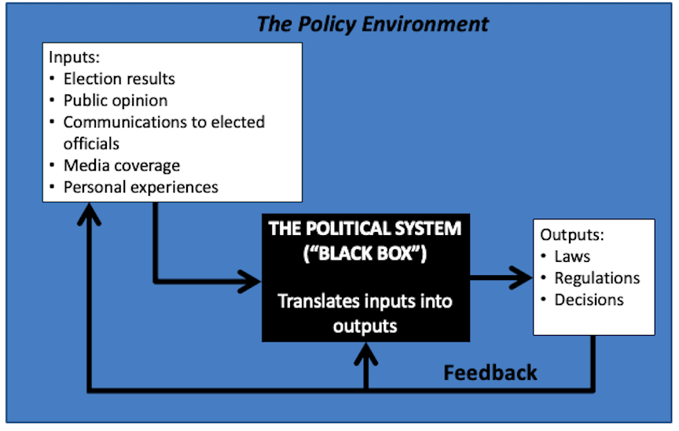
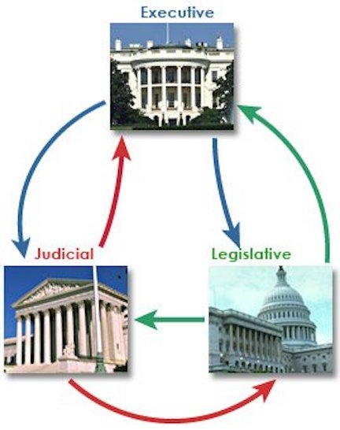
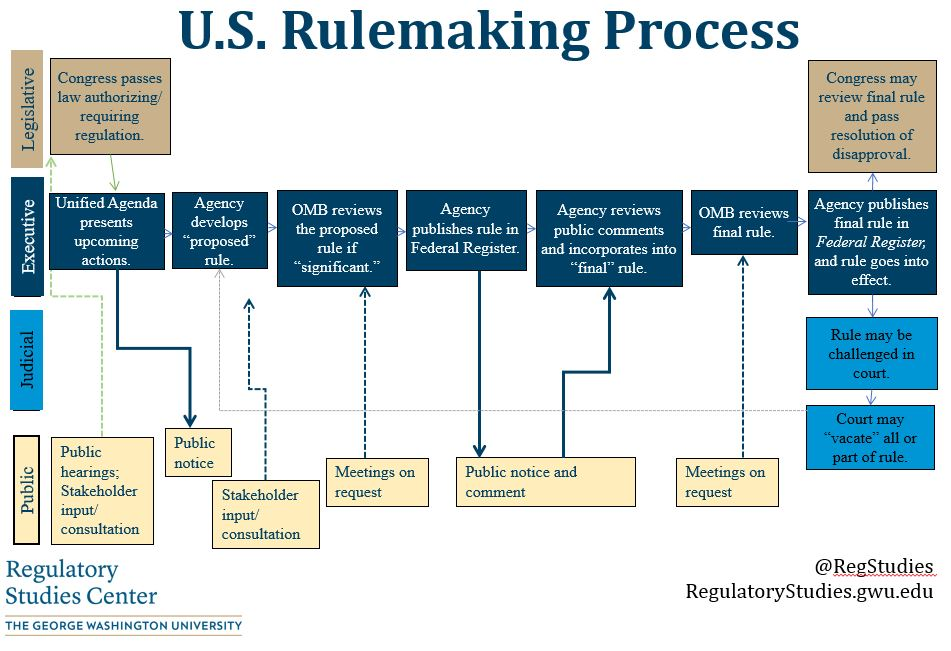

  
```{r setup, include=FALSE}
knitr::opts_chunk$set(warning = FALSE, message = FALSE, 
                      fig.retina = 3, fig.align = "center")
```


.pull-left[
# Institutions 
<figure>
  
</figure>
]

.pull-right[

</br>
</br>
</br>
**POLI 211: Introduction to Public Policy**

**Spring 2022**

.light[Matthew Nowlin, PhD<br>
Department of Political Science<br>
College of Charleston
]

]

---

class: center, middle

# What role do institutions play in policymaking? 

---

class: title title-1

# Policymaking Process 

<figure>
<center>
  
</figure>

---

class: title title-1

# Institutions 

</br> 

## Organizations as well as systems in which individuals interact and achieve political and policy goals through explicit and implicit rules that evolve over time through cooperative means


---

class: title title-1

# Institutions

**The rules of the game that structure interactions** 

--

.pull-left[

* _Formal_ (explicit):
  * Written down 

* _Informal_ (implicit): 
  * Norms 
]

.pull-right[

]

---

<iframe src="https://embed.polleverywhere.com/multiple_choice_polls/EMWHsgPAjhlS0bPvyAoBM?controls=none&short_poll=true" width="800px" height="600px"></iframe>

???
pollev q
---

class: title title-1

# Institutions and Democracy 

> If a _country_ is to be governed democratically, what would be required? At a minimum, it would need to possess certain political arrangements, practices, or institutions that would go a long way, even if not all the way, toward meeting ideal democratic criteria. 

.tr[
— Dahl, pg 83
]

---

class: title title-1

# What is Democracy? 

**Criteria for a democratic process** 

* Effective participation 

* Equality in voting 

* Gaining enlightened understanding 

* Exercising final control over the agenda 

* Inclusion of adults 

???

Effective participation: all members must have _equal and effective opportunities_  to make their views known 

Equality in voting: all members must have an _equal and effective opportunity_ to vote and all votes must be counted as equal 

Gaining enlightened understanding: _equal and effective opportunities_  for learning about relevant alternative policies and their likely consequences 

Exercising final control over the agenda: members must have the exclusive opportunity to decide how and, if they choose, what matter will be placed on the agenda 

Inclusion of adults: all (or at least most) adult permanent residents should have the full rights of citizens that are implied by the first four criteria 

---


class: title title-1

# Institutions and Democracy 

**What political institutions does large-scale democracy require?** 

--

* Elected officials 

???
representative

--

* Free, fair, and frequent elections 

--

* Freedom of expression 

--

* Alternative sources of information 

--

* Associational autonomy 

--

* Inclusive citizenship 

---

class: title title-1

# Institutions and Democracy 

**What political institutions does large-scale democracy require?** 

_Elected officials_ 

* Effective participation 
* Control of the agenda 

--

_Free, fair, and frequent elections_ 
* Voting equality 
* Control of the agenda

---

class: title title-1

# Institutions and Democracy 

**What political institutions does large-scale democracy require?** 

_Freedom of expression_ 
* Effective participation 
* Enlightened understanding 
* Control of the agenda 

---

class: title title-1

# Institutions and Democracy 

**What political institutions does large-scale democracy require?** 


_Alternative sources of information_ 
* Effective participation 
* Enlightened understanding 
* Control of the agenda 

---

class: title title-1

# Institutions and Democracy 

**What political institutions does large-scale democracy require?** 


_Associational autonomy_ 
* Effective participation 
* Enlightened understanding 
* Control of the agenda 

--

_Inclusive citizenship_ 
* Full inclusion 

---

class: title title-1

# _Official_ and _Unofficial_ Actors

--

**Official actor**: A participant in the policy process whose involvement is motivated or mandated by their _official position in a government agency or office_ 

-*Birkland*, pg 115

--

**Examples?** 

---

class: title title-1

# _Official_ and _Unofficial_ Actors

**Unofficial actor**: A participant in the policy process who does _not_ have constitutionally or legally created incentives or mandates to be a part of the process, yet are important to the policy process 

-*Birkland*, pg 115

--

**Examples?** 

---

<iframe src="https://embed.polleverywhere.com/multiple_choice_polls/ORwD8jNub3d5wbqGFbOou?controls=none&short_poll=true" width="800px" height="600px"></iframe>

---

class: title title-1

# Official Actors 

.pull-left[
<figure>
  
</figure>
]

.pull-right[

]

---

class: title title-1

# Legislative Branch

<figure>
<center>
  
</figure>

---

class: title title-1

# Legislative Branch

**Article I in the Constitution** 

--

* Form of policy: Make _laws_ 

  * How does a bill become a law? 

--

.pull-left[
<figure>
  
</figure>
]

--

.pull-right[
<figure>
  
</figure>
]

---

class: title title-1

# Legislative Branch

**Article I in the Constitution** 

* Hold _hearings_

--

* Perform _oversight_ over the executive branch

--

* Do _casework_ for constituents

---

class: title title-1

# Organization of the Legislative Branch 

--

.pull-left[
**Parties**

* Elect the presiding officer or speaker

* Determine who sits on committees
]

--

.pull-right[
**Committees**

* Chairs are very powerful

* Screen bills

* Set the legislative agenda
]

---

<iframe src="https://embed.polleverywhere.com/multiple_choice_polls/SyEHW5Gr7ztsKqr0U0IqI?controls=none&short_poll=true" width="800px" height="600px"></iframe>

???
quiz question

---

class: title title-1

# Executive Branch 

<figure>
<center>
  
</figure>

---

class: title title-1

# Executive Branch: The President

**Article II in the Constitution** 

--

* The head of a _unitary_ branch

--

_Presidential powers can be divided into two categories_: 
* Expressed power: Direct action 
* Implied powers: Chief administrator 

---

class: title title-1

# Executive Branch: The President

**Article II in the Constitution** 

**Expressed powers**: Direct Action
.pull-left[
* Veto
* Appointment powers
]

.pull-right[
* Pardons 
* Treaties; Executive agreements  
]

---

class: title title-1

# Executive Branch: The President

**Article II in the Constitution** 

**Implied powers**: Chief administrator

_Take Care Clause_: "_he shall take Care that the Laws be faithfully executed_"

--

* Form of policy: _Executive orders_ 
  * _Executive orders_: Direct government agencies to pursue a certain course in the absence of congressional action

---

class: title title-1

# Executive Branch: The President

**Article II in the Constitution** 

**Implied powers**: Chief administrator

_Take Care Clause_: "_he shall take Care that the Laws be faithfully executed_"

* Other implied powers: 
  * Wage war
  * Domestic security
  * Executive privilege


---

class: title title-1

# Informal Powers 

__Bully Pulpit__: Theodore Roosevelt’s notion of the presidency as a platform from which the president could push an agenda

--

__Going Public__: a term for when the president delivers a major television address in the hope that public pressure will result in legislators supporting the president on a major piece of legislation 

--

_The power of the presidency is the power to persuade_ 


---

class: title title-1

# Executive Branch: The President

**Article II in the Constitution** 

.pull-left[
**Advantages** 
* Attracts a lot of media and public attention 
* Information about what government is doing 
* _Agenda-setting_ 

]

--

.pull-right[
**Limits**:
* Inability to force action 
* Size of staff 
* The other branches 
]

---

<iframe src="https://embed.polleverywhere.com/multiple_choice_polls/ynrs6jRrqmXnlT6nFzJ7E?controls=none&short_poll=true" width="800px" height="600px"></iframe>

???
pollev
---

class: title title-1

# Executive Branch: Agencies

**Bureaucracy**:

--

* Division of labor

--

* Impersonal, unbiased rules

--

* Staff expertise among _civil servants_ 

--

* Obvious hierarchy

---

class: title title-1

# Executive Branch: Agencies

**Civil servants**:

--

* Selected on merit

--

* Possess technical knowledge

* [usajobs.gov](https://www.usajobs.gov/)


---

class: title title-1

# Executive Branch: Bureaucrats 

**Bureaucrats are not elected, yet they make policy** 

--

* Form of policy:  _Regulations_ made through the rule-making process 

--

* Bureaucrats are supposed to act in the _public interest_

--

* Bureaucrats are given more or less discretion based on 
  * Expertise
  * Authority 
  * Leadership
  * Political acceptability

---

<figure>
<center>
  
</figure>

---

class: title title-1

# Judicial Branch 

<figure>
<center>
  
</figure>

---

class: title title-1

# Judicial Branch 

**Article III of the Constitution** 

--

* Form of policy: _Court decisions_

--

* _The least dangerous branch_ 

--

* Common law
  * _Judicial review_: established in _Marbury v. Madison_ (1803)  
  * Precedent 

---

class: title title-1

# Separation and Sharing of Powers 

<br>

| Congress | President | Courts 
--- | --- | --- | --- 
Legislative | **make laws** | recommend laws, veto, regulations | review laws  
Executive | override vetos, oversight | **enforce and implement laws** | review executive acts 
Judicial | advise and consent | pardon, nominate judges | **interpret laws** 


