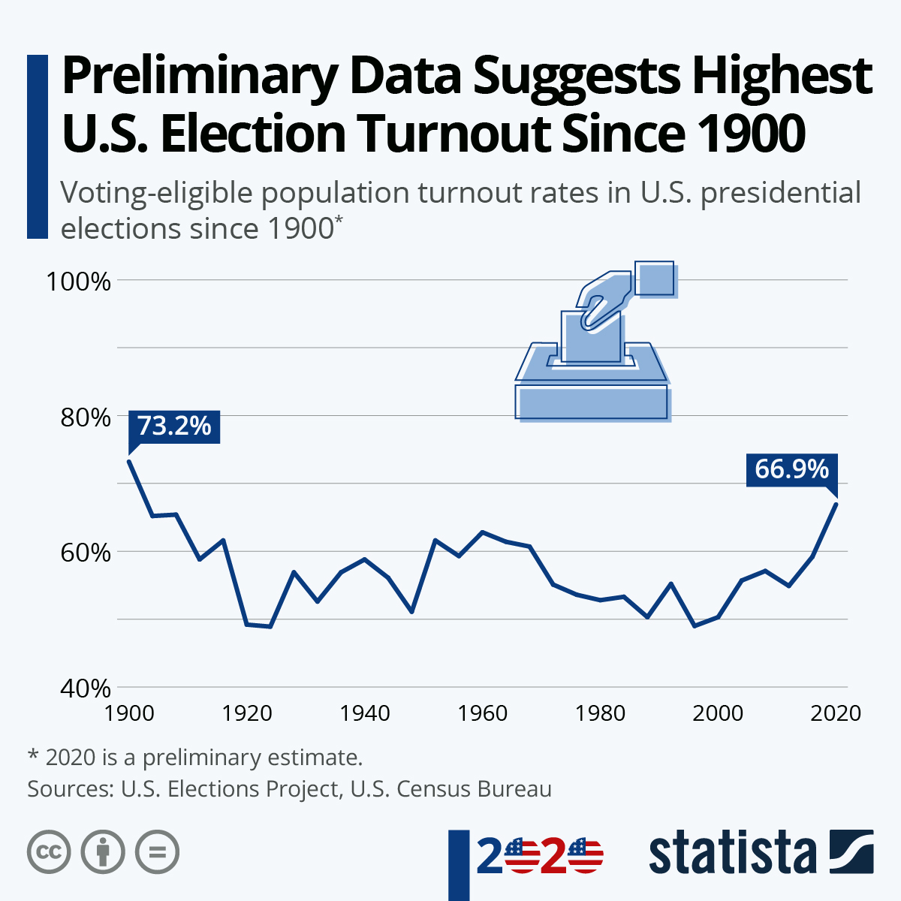

  
```{r setup, include=FALSE}
knitr::opts_chunk$set(warning = FALSE, message = FALSE, 
                      fig.retina = 3, fig.align = "center")
```

```{r xaringanExtra, echo=FALSE}
xaringanExtra::use_webcam()
```

.pull-left[
# Actors and Subsystems 
<figure>
  
</figure>
]

.pull-right[

</br>
</br>
</br>
**POLI 211: Introduction to Public Policy**

**Fall 2021**

.light[Matthew Nowlin, PhD<br>
Department of Political Science<br>
College of Charleston
]

]

---

class: center, middle

# What role do unofficial actors play in policymaking? 

---

class: title title-1 

# Unofficial Actors 

<br>

> **Unofficial actor**: A participant in the policy process who does _not_ have constitutionally or legally created incentives or mandates to be a part of the process, yet are important to the policy process 

> -*Birkland*, pg 115

---

class: title title-1 

# Unofficial Actors 

<figure>
<center>
  
</figure>

---

class: title title-1 

# Unofficial Actors 

--

**Individual citizens**

--

**Interest groups**

--

**Political parties**

--

**Think tanks and research groups**

--

**Media** 

---

class: title title-1

# Mobilization 

</br>
> ## The process by which people or groups are motivated to take action, such as through lobbying, protest, or any other form of expression in response to an issue or problem 

> -*Birkland*, pg 167

---

class: title title-1

# Mobilization and Counter-Mobilization 

--

<center>


---

class: title title-1

# The Public Interest 

> The assumed broader desires and needs of the public, in whose name policy is made. The public interest is hard to define, but is something to which all policy advocates appeal. 

> -*Birkland*, pg 167

--

* The sum of individual and group activity may not equal _the public interest_ 

--

* Public interest or competing narrow interests? 

---

<iframe src="https://embed.polleverywhere.com/multiple_choice_polls/sh6L461WgDIF50N1KiP9S?controls=none&short_poll=true" width="800px" height="600px"></iframe>

???
quiz q 
---

class: title title-1

# Individual Citizens

**Why do we consider citizens as unofficial actors?**

--

**What are some issues with citizen engagement?**

--

* Low election turnout, but...

--

* Low levels of knowledge

--

* Low levels of motivation to become involved

---

class: title title-1

# Voting 

.pull-left[
<br>
<figure>
  
</figure>
]

--

.pull-right[
<figure>
  
</figure>
]

---

class: title title-1

# Individual Citizens

**Low levels of other activity**
* Participating in rallies
* Signing petitions
* Joining groups
* _Young people are traditionally the least engaged_ 

---

class: title title-1

# Interest Groups

--

</br> 

> **A collection of people or organizations that unite to advance their desired political (and policy) outcomes in government and society.** 

> -*Birkland*, pg 168

---

class: title title-1

# Interest Groups

**Why are groups so important?**

--

* Aggregation of resources

--

* Aggregation of members = power

--

* Forming _advocacy coalitions_

--

* _Grassroots_ vs. _AstroTurf_

--

* Why are groups or _special interest groups_ sometimes viewed as a bad thing?

---

class: title title-1

# Interest Groups


**Major growth in interest groups in the 1960s**  

<br>

<figure>
<center>
  
</figure>

???
encyclopedia of associations 

---

class: title title-1

# Interest Groups


**Major growth in interest groups in the 1960s**  

<br>

.pull-left[
<figure>
<center>
  
</figure>
]

.pull-right[
**Growth of interest groups $\leftrightarrow$ Growth of government** 

**Social movements and demand for government action**
]
???
encyclopedia of associations 


---

class: title title-1

# Interest Groups

**Social movements** 

--

.pull-left[

> A broad-based effort by a large group of people to make fundamental changes in public policy and attitudes

> -*Birkland*, pg 177

]

.pull-right[
<figure>
  
</figure>
]

---

<iframe src="https://embed.polleverywhere.com/multiple_choice_polls/HjxK9sSc9pZpK8rcnzKMG?controls=none&short_poll=true" width="800px" height="600px"></iframe>

???
quiz q 
---

class: title title-1

# Interest Groups: Types

--

**Institutional** 

--

**Membership interest groups**  

.pull-left[
* Economic (private interest)
    * Are primarily interested in benefits for members
]

--

.pull-right[
* Public interest groups
    * Seek to create broad benefits for everyone
]

--

**Others such as religious or ideological groups** 

---

class: title title-1

# What Interest Groups Do

.pull-left[
**What people think they do ...** 
<figure>
  
</figure>
]


--

.pull-right[
**... what they actually do**
* _Venue shopping_ 
* Lobbying
* Support candidates* 
* Mobilize members to take action


<br>
.footnote[.small[*Mostly their friends]]
]

---

class: title title-1

# What Interest Groups Do

.pull-left[
**Venue shopping**: _Interest groups choose which branch or agency of government to lobby or persuade_ 

-*Birkland*, pg 175
]

--

.pull-right[
**Lobbying**: _The term applied to the organized and ongoing process of persuading the legislative or executive branches to enact policies that promote an individual's or group's interest_ 

-*Birkland*, pg 173 
]

---

class: title title-1

# Interest Groups

**Do some interest groups have more power than others?** 

--

.pull-left[
**Peak associations** 
* Resources
    * Money
    * Information

* Size of membership
]    

--

.pull-right[
**Overcome free-riding** 
* Reasons for membership
    * Direct economic incentives
    * Material inducements
]

--

**Congruence of goals with prevailing ideas and values** 

---

<iframe src="https://embed.polleverywhere.com/multiple_choice_polls/MgpxJ9kepcOMsnd5A9KeX?controls=none&short_poll=true" width="800px" height="600px"></iframe>

???
quiz q
---

class: title title-1

# Political Parties 

<figure>
<center>
  
</figure>


---

class: title title-1

# Political Parties 

**Role in policymaking** 

--

* They aggregate preferences into broad coalitions

--

* They organize the legislative branch

--

* They provide opportunities for participation

--

* They help integrate national and state politics


---

class: title title-1

# Political Parties 

<figure>
<center>
  
</figure>

<br>

---

class: title title-1

# Research Institute (Think Tank) 

--

**Independent research organizations that provide information about public policy**

--

.pull-left[
Research-oriented
* _Goals_: to provide research and information for policy makers to promote “the public interest”
]

--

.pull-right[
Ideological
* _Goals_: to influence public policy, often in a way consistent with their ideological perspective
]

--

**Examples ?**

---

class: title title-1

# The Media 

**What role does the media play in policymaking?** 

--

Serve as _watch dogs_ that keep track of government
* This is the role assumed in the First Amendment
* Investigative journalism

--

But, very little news (<1%) is the result of investigative journalism

--

Most news in an average newspaper is wire service copy, press releases, etc.

---

class: title title-1

# The Media 

**What role does the media play in policymaking?** 

Much of what is printed or aired is because of the beat system and personal relationships with sources

--

_Journalistic norms_ vs _Profitability_  

---

class: title title-1 

# The Media: Bias  

<figure>
<center>
  
</figure>

---

class: title title-1

# The Media: Bias  

* **Personalized news** 
    * The _Daily Me_ 

--

* **Dramatized news** 
    * _If it bleeds, it leads_ 

--

* **Fragmented news** 
    * Choice of source and time of consumption 

--

* **What about-ism**  
    * Present "both sides" to appear fair and impartial 


???
what to think about, not what to think
---

class: title title-1 

# The Media: Framing 

**Increases in murder in 2020** 

--

.pull-left[
<figure>
<center>
  
</figure>
]

--

.pull-right[
<figure>
<center>
  
</figure>
]

---

class: title title-1

# The Media: Trust

--

.pull-left[
<figure>
  
</figure>
]

--

.pull-right[
<figure>
  
</figure>
]

---

<iframe src="https://embed.polleverywhere.com/multiple_choice_polls/IMpC6DDY3jzqpMAu2pYyI?controls=none&short_poll=true" width="800px" height="600px"></iframe>

???
pollev
---

class: center, middle

# What are policy subsystems? 

.footnote[... or sub-governments, issue networks, domains, communities]

---

class: title title-1

# Policymaking System 

<figure>
<center>
  
</figure>


---

class: title title-1

# Policy Subsystems 

> _The institutions and actors, including both governmental [official] and nongovernmental [unofficial], that are most involved in policymaking within a particular policy domain_


--

* Subsystems are organized around a __policy domain__ 

--

* **Policy domain**: Substantive area of policy over which participants in policy making compete and compromise


---

class: title title-1

# Subsystem Types

--

**Iron triangles**: mutually reinforcing relationships between a _regulated interest_, an _agency_, and a _congressional committee_    

--

**Issue networks**: open venues and possibly contentious relationships between actors     

--

**Think of them as existing on a continuum, from an iron triangle to an issue network**  

---

class: title title-1

# Iron Triangles and Issue Networks 

<figure>
<center>
  
</figure>


