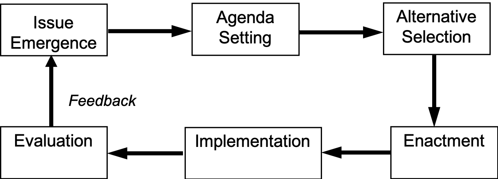
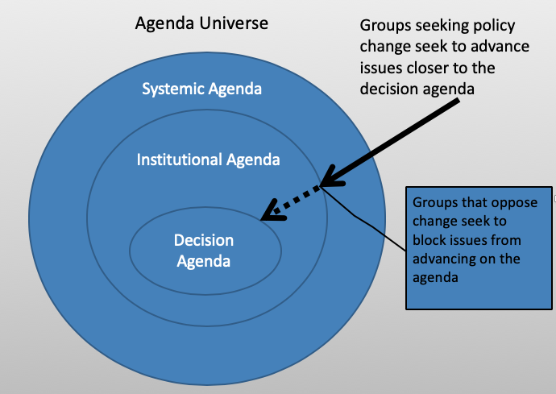
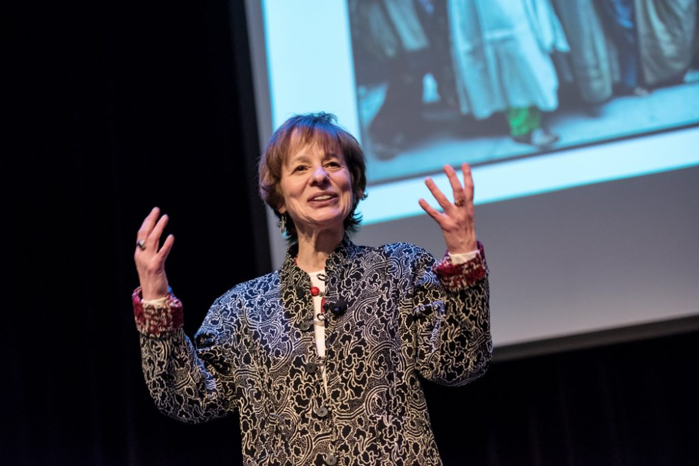
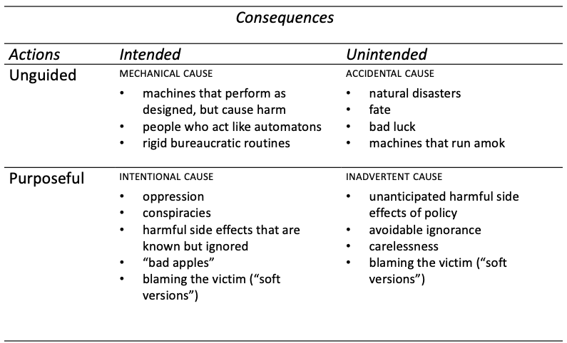

  
```{r setup, include=FALSE}
knitr::opts_chunk$set(warning = FALSE, message = FALSE, 
                      fig.retina = 3, fig.align = "center")
```

```{r xaringanExtra, echo=FALSE}
xaringanExtra::use_webcam()
```

.pull-left[
# Agenda <br> Setting 
<figure>
  
</figure>
]

.pull-right[

</br>
</br>
</br>
**POLI 211: Introduction to Public Policy**

**Fall 2021**

.light[Matthew Nowlin, PhD<br>
Department of Political Science<br>
College of Charleston
]

]

---

class: title title-1

# Policymaking System 

<figure>
<center>
  
</figure>


---

class: title title-1

# Policy Stages 

<figure>
<center>
  
</figure>


---

class: title title-1

# What is an Agenda? 

--

<br>

> **The list of things being discussed and sometimes acted upon by an institution, the news media, or the public at large**

> -*Birkland*, pg 207

---

class: title title-1

# What is Agenda Setting? 

--

<br>

> **The process by which problems and alternative solutions gain or lose public and elite attention, or the activities of various actors and groups that cause issues to gain greater attention or prevent them from gaining attention**

> -*Birkland*, pg 210

---

<iframe src="https://embed.polleverywhere.com/multiple_choice_polls/Np08fmmthLAIiGdbMlC3Y?controls=none&short_poll=true" width="800px" height="600px"></iframe>

???
pollev
---

class: title title-1

# Levels of the Agenda 

<figure>
<center>
  
</figure>


---

class: title title-1

# How Do Issues Reach the Agenda?

--

**Group reactions to other groups’ actions/success**
* Mobilization and counter-mobilization 

--

**Expansion of conflict**

--

**Crises and focusing events**
* _Focusing event_: A sudden event that can generate attention to public problems or issues, particularly issues and problems that are actually or potentially harmful

---

class: title title-1

# How Do Issues Reach the Agenda?


**Social and protest movements**

--

**Media coverage or activity**
* May lead to increased public concern 

--

**Changes in indicators**
* Numbers

--

**Political changes**

---

<iframe src="https://embed.polleverywhere.com/multiple_choice_polls/opXyMEq6djZ3yr8YNTwj4?controls=none&short_poll=true" width="800px" height="600px"></iframe>

???
quiz q
---

class: center, middle 

# The importance of power

---

class: title title-1

# Mobilization and Counter-Mobilization 

.pull-left[
<br>
<figure>
  
</figure>
]

--

.pull-right[
**Pluralism**
* Many groups 
* Reasonably open political system 
* Policy results from group competition
]

---

class: title title-1 

# Elitism 

.pull-left[
**Policymaking is dominated by the best-educated, wealthiest, and most powerful elites**

_The heavenly chorus of pluralism has a thick upper-class accent_ 

-*E.E.  Schattschnieider*
]

.pull-right[
<br>


]


---

class: title title-1

# Power

**The ability to get what you want and to prevent others from getting what they want**

--

**Politics: Who gets what, when, and how** 

--

**The two faces of power** 
* _Positive power_: _A_ participants in the making of decisions that affect _B_ even if _B_ does not like the decisions or their consequences 


---

class: title title-1

# Power

**The ability to get what you want and to prevent others from getting what they want**

**Politics: Who gets what, when, and how** 

**The two faces of power** 
* _Negative power_: _A_ prevents _B_'s issues and interests from getting on the agenda or becoming policy, even when _B_ really wants those issues raised  


---

class: title title-1

# Power and Agenda Setting 

--

**Powerful actors and groups can** 

* Shape the agenda

--

* Influence the depiction of public problems

--

* Influence the nature of the alternative solutions to problems

--

_The definition of the alternatives is the supreme instrument of power_

-*E.E.  Schattschnieider*

---

<iframe src="https://embed.polleverywhere.com/multiple_choice_polls/hOmi6iT6TIvqKUbFxQK8F?controls=none&short_poll=true" width="800px" height="600px"></iframe>

???
quiz q
---

class: title title-1

# Mobilization of Pro-Change Interests

**Some potential strategies** 

--

* Broaden the scope of conflict 

--

* Use of _symbols_ 

--

* _Windows of opportunity_ 

--

* Indicators: require interpretation 

--

* Focusing events 

--

* _Venue shopping_ 

---

class: title title-1

# Issue Definitions 

**Framing, or the social construction of problems**

--

* Problems need to be defined; they are not self-evident

_What private troubles warrant definition as public problems and thereby legitimately raise claims for remedy with public resources?_ 

--

* Pro-change groups must make a case for “solving” problems

--

* Must persuade people that a problem exists that can be addressed


---

class: title title-1

# Issue Definitions 

**Framing, or the social construction of problems**

.pull-left[
_Problems are defined using_
* Symbols and stories
  * Narrative stories 
  * Helplessness and control 
  * Horror stories 
  * Causal stories
]

.pull-right[
<figure>
  
</figure>
<center>
.small[_Deborah Stone_]
]


---

class: title title-1

# Conditions and Problems

--

**Conditions**: situations about which little can be done 

--

**Problems**: situations about which something might be done


--

**Conditions become problems**

.pull-left[
* When knowledge increases
* When technology changes
]

--

.pull-right[
* When cultural and political norms change
* When a _cause_ is identified 
]

---

class: title title-1 

# Types of Causal Theories with Examples

<figure>
<center>
  
</figure>

