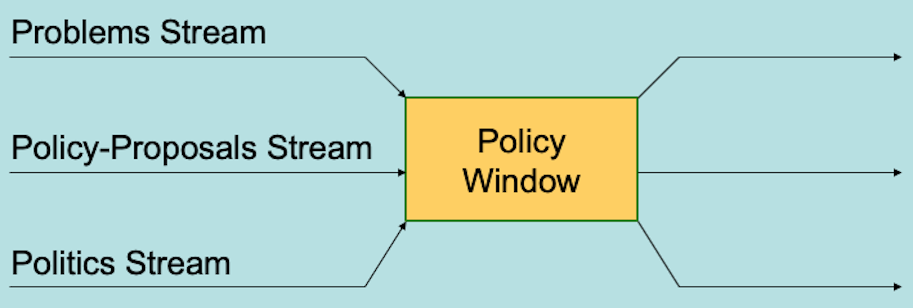

  
```{r setup, include=FALSE}
knitr::opts_chunk$set(warning = FALSE, message = FALSE, 
                      fig.retina = 3, fig.align = "center")
```

```{r xaringanExtra, echo=FALSE}
xaringanExtra::use_webcam()
```

.pull-left[
# Policy <br> Formulation 
<figure>
  
</figure>
]

.pull-right[

</br>
</br>
</br>
**POLI 211: Introduction to Public Policy**

**Fall 2021**

.light[Matthew Nowlin, PhD<br>
Department of Political Science<br>
College of Charleston
]

]

---

class: center, middle

# How are policy problems addressed? 

---

class: title title-1

# Policy Formulation 

--

</br>
</br>

> **Development of pertinent and acceptable proposed courses of action for dealing with public problems**

> -*Anderson*, pg 114 

---

class: title title-1

# Multiple Streams 

<figure>
<center>
  
</figure>

---

class: title title-1

# The Formulation of Policy Proposals

**Key questions**

--

* Is the policy technically sound?

--

* Are the budgetary costs reasonable?

--

* Is the proposal politically acceptable?

--

* If the proposal becomes law, will the public accept it?

---


???
pollev
---

class: title title-1

# The Formulation of Policy Proposals

**Who is involved?** 

--

* President and advisers (leading source of policy initiatives)

--

* Governmental agencies

--

* Presidential organizations (task forces, commissions)

--

* Legislators

--

* Interest groups

---

class: title title-1

# A Technical Process

**Two different activities involved in formulation**

--

* Decisions on what, if anything, should be done about a given problem

--

* Adoption of legislation or administrative rules that appropriately enact the agreed upon principles


