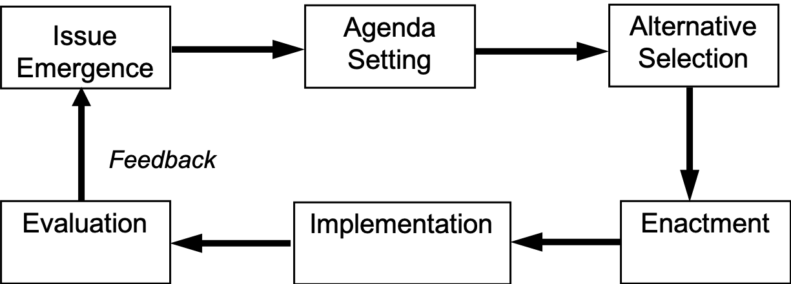
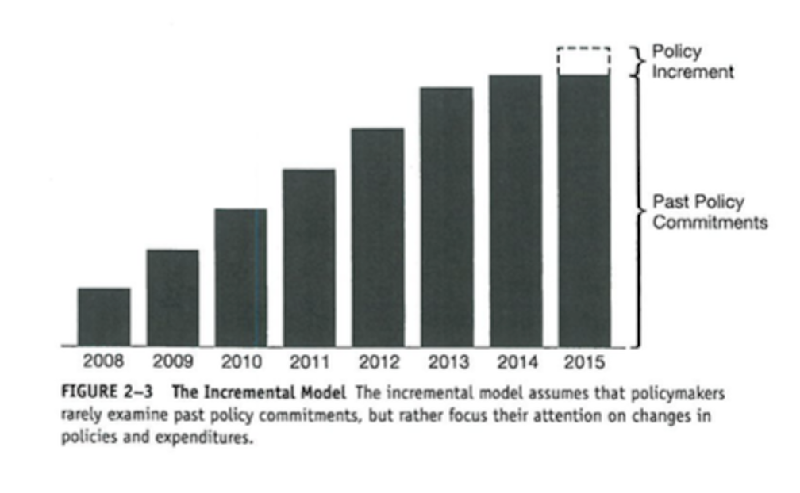

  
```{r setup, include=FALSE}
knitr::opts_chunk$set(warning = FALSE, message = FALSE, 
                      fig.retina = 3, fig.align = "center")
```

```{r xaringanExtra, echo=FALSE}
xaringanExtra::use_webcam()
```

.pull-left[
# Decision-Making <br> Policy Analysis
<figure>
  
</figure>
]

.pull-right[

</br>
</br>
</br>
**POLI 211: Introduction to Public Policy**

**Fall 2021**

.light[Matthew Nowlin, PhD<br>
Department of Political Science<br>
College of Charleston
]

]

???
annoucements: 

mid-term grades 

issue paper 3: nov 3 

reading for next week (sunstein interview) on OAKS 

---

class: title title-1

# Policymaking System 

<figure>
<center>
  
</figure>


---

class: title title-1

# Policy Stages 

<br>
<figure>
<center>
  
</figure>

---

class: title title-1

# Policy Formulation 

</br>
</br>

> **Development of pertinent and acceptable proposed courses of action for dealing with public problems**

> -*Anderson*, pg 114 

---

class: title title-1

# The Formulation of Policy Proposals

**Key questions**

* Is the policy technically sound?

* Are the budgetary costs reasonable?

* Is the proposal politically acceptable?

* If the proposal becomes law, will the public accept it?


---

class: center, middle 

#  How do we get from policy formulation $\rightarrow$ alternative selection $\rightarrow$ enactment? 

---

<iframe src="https://embed.polleverywhere.com/multiple_choice_polls/VuL6xLtrq4pcLqckVFDAH?controls=none&short_poll=true" width="800px" height="600px"></iframe>

???
fall break quiz q
---

class: title title-1

# Some General Concepts

**All policies have goals** 

--

**What is the difference between a policy _output_ and an _outcome_**?

--

* **Output**: The measurable things an agency or organization produces 

--

* **Outcome**: The substantive results of the implementation of a policy 

--

**Policy goals are related to outcomes**

---


class: center, middle

# How do we decide which policy idea is most likely to achieve the desired outcome? 

---

class: title title-1

# Policy Analysis 

--

</br>

> **The practice by which policy analysts use various analytic tools, often derived from fields such as operations research, statistics, and economics, to understand the likely outcomes and benefits of particular policy ideas.** 

-*Birkland*, pg. 285 

---

class: title title-1

# Policy Analysis 

--

**Identify _causal models_ of policy** 

* How does policy (X) impact outcome (Y)? 

* _How would a carbon tax reduce GHG emissions?_  

--

**Practice of policy analysis** 

* Quantitative, based in micro-economics

* Cost-Benefit Analysis 

---

class: title title-1

# Policy Analysis 

**Role of the policy analyst and analytical integrity** 

--

* **Objective Technician**: _Let the analysis speak for itself_  

--

* **Client's Advocate**: _Take advantage of ambiguity to advise clients' positions_  

--

* **Issue Advocate**: _Emphasize ambiguity and excluded values when analysis does not support advocacy_  

---

<iframe src="https://embed.polleverywhere.com/multiple_choice_polls/GYf8XkgP2oPyyBlFJhhTS?controls=none&short_poll=true" width="800px" height="600px"></iframe>

???
pollev
---

class: title title-1

# A (Very) Brief History of Policy Analysis 

--

**_Muller v. Oregon_ (1908)**

--

**Use of rationality to solve public problems** 
* Expanding knowledge in universities
* Increasing policy demands from the New Deal

--

**The "Whiz Kids"** 
* Application of cutting-edge social science 

--

**Policy analysis was well-established by the 1960s** 

???
_Muller v. Oregon_ (1908): the supreme court accepted a legal brief that used social scientific data about the harms of working too many hours 
---

class: title title-1

# A (Very) Brief History of Policy Analysis 

.pull-left[
**Policy Sciences**
* Orientation toward problem solving, based in theory and empiricism 
* The multidisciplinary nature of policy sciences
* A value component: Politics matter 
]

.pull-right[
<figure>
<center>
  
</figure>
<center>
_Harold Lasswell_
]

---

class: title title-1

# Policy Analysis 

**The steps**: 

--

1. Define the problem

--

1. Identify the goals in addressing the problem

--

1. Consider solutions

--

1. Evaluate the alternatives

--

1. Make a recommendation

---

.center[]

---

class: title title-1

# Politics, Policy, and Policy Analysis

**Two logics of policymaking**
 
--

**Economic rationality (policy analysis/technocracy)** 

--

* Application of economic logic to political phenomena as a way to bypass the "messiness" of politics

--

* Transparent assumptions

--

* Consistent methods to compare policy alternatives 


---

class: title title-1

# Politics, Policy, and Policy Analysis

**Two logics of policymaking**
 

**Political rationality (political actors)** 

--

* Strategic use of information 

--

* Release of favorable information and suppression of unfavorable information 


---

class: center, middle

# How did you decide where to go to college? 

---

class: title title-1

# Decision-Making Models 

**Rational comprehensive** 

> **A model of decision making in which it is assumed that decision makers have nearly all information about a problem, its causes, and its solutions at their disposal, whereupon a large number of alternatives can be weighed and the best one selected** 

-*Birkland* pg. 296

---

class: title title-1

# Decision-Making Models 

**Rational comprehensive** 

--

* Analysis of goals and tools is separate

--
* Goals isolated before tools are selected

--
* Good policy is the _technically_ best policy

--
* All important factors considered

--
* Heavy reliance on theory

--
* **Complete information** 

---

class: title title-1

# Decision-Making Models 

**Bounded rationality**

> **A term that describes how decision-makers seek to act as rationally as possible within certain bounds or limits; these limits include time, limited information, and our limited human ability to recognize every feature and pattern of every problem** 

-*Birkland* pg. 297


---

class: title title-1

# Decision-Making Models 


**Bounded rationality**
--

* Goals and tools are _closely intertwined_ 

--
* Means and ends (tools and goals) are not distinct

--
* Good policy is one where consensus is reached on adoption

--
* Analysis is limited 

--
* Successive comparisons _reduces or eliminates reliance on theory_

--
* **Incomplete information**


???
decision-making models of individuals
---

class: title title-1

# Decision-Making Models

## _Decision-making models_ $\rightarrow$ _Policymaking_

--

</br>
**Rational comprehensive $\rightarrow$ Rational comprehensive (Technocratic)**

--

</br>
**Bounded rationality $\rightarrow$ Incrementalism** 

---

class: title title-1

# Incrementalism 

.pull-left[
_Policy change is accomplished through small, incremental steps that allow decision-makers to adjust policies as they learn from their successes and failures_
]

.pull-right[

]

---

class: title title-1

# Incrementalism 

**Decisions are made in increments, which allow for**:


--


* “Successive limited comparisons”—that is, tests and adjustments of policy

--
* Not having to separate means from ends, which could slow decisions

--

**Policymaking consists of both incrementalism and sudden, rapid change** 


