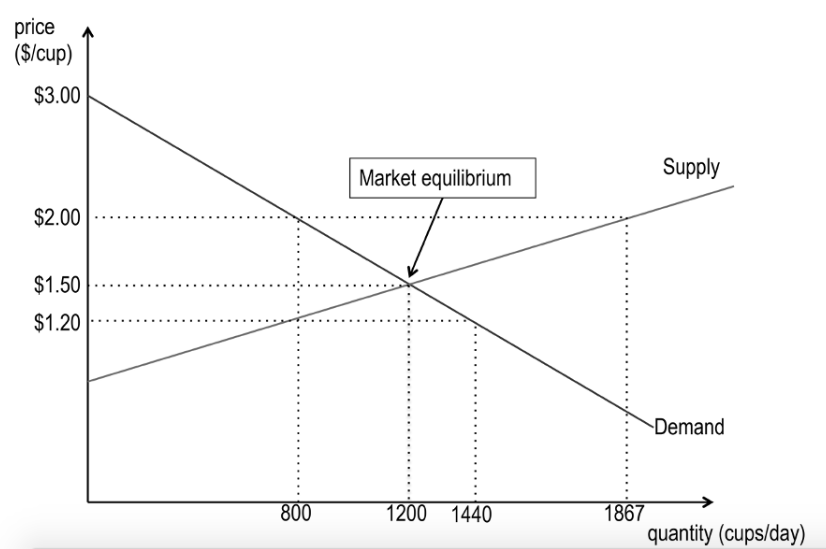

  
```{r setup, include=FALSE}
knitr::opts_chunk$set(warning = FALSE, message = FALSE, 
                      fig.retina = 3, fig.align = "center")
```

```{r xaringanExtra, echo=FALSE}
xaringanExtra::use_webcam()
```

.pull-left[
# Policy <br> Analysis

<figure>
  
</figure>
]

.pull-right[

</br>
</br>
</br>
**POLI 211: Introduction to Public Policy**

**Fall 2021**

.light[Matthew Nowlin, PhD<br>
Department of Political Science<br>
College of Charleston
]

]

---

class: center, middle

# Why do we need public policy?

---

<iframe src="https://embed.polleverywhere.com/multiple_choice_polls/CEgVBnUODlT2rIgRCYwdT?controls=none&short_poll=true" width="800px" height="600px"></iframe>

???
quiz q
---


class: center, middle

# Why do we need public policy?

---

class: center, middle

# How do we in the US typically determine the allocation of good and services?  

---

class: title title-1

# The Market 

--

**A market is a _decentralized_ collection of buyers and sellers whose interactions determine the allocation of a good or a set of goods through _exchange_**


--
**Decentralized** 
* The price and quantity of goods are determined by the _interaction of supply and demand_ 

---

class: title title-1

# The Market 

**A market is a _decentralized_ collection of buyers and sellers whose interactions determine the allocation of a good or a set of goods through _exchange_**

**Exchange** 
* Payment for goods/services

---

class: title title-1

# The Market 

**When assumptions are (mostly) met, markets provide the most _efficient_ allocation of goods/services** 

--

.pull-left[
**Efficiency**

* No one in society could be made better off, without someone else being made worse off 

]


.pull-right[

]


---

class: center, middle

# Why do we need public policy?

---

class: center, middle

# Sometimes markets fail 

---

class: title title-1

# Market Assumptions  

--

**Perfect competition** 
* No seller or buyer can independently affect price 

--

**Perfect information** 
* Buyers and sellers know the quality of the good 

--

**Perfectly complete** 
* All relevant costs and benefits are borne by the buyers and sellers 

---

class: title title-1

# Market Failures


~~**Perfect competition**~~ 
* Insufficient competition: _Monopoly_

--

~~**Perfect information**~~
* Asymmetric information: _Used cars_

--

~~**Perfectly complete**~~
* Externalities: _Social cost $>$ Private cost_ 


---

background-image: url(img/goods.jpg)
background-position: 50% 50%
background-size: 100%
class: center, top, fullscale

# Also: Types of goods

---

class: title title-1

# Public Policy

.pull-left[
**Types of goods**
* Common-pool: _over consumed_
* Public good: _under produced_ 
]

--

.pull-right[
**Other reasons for policy**
* Equality 
* Security 
* Protect rights 
]

---

class: center, middle

# How do we get from policy formulation $\rightarrow$ alternative selection $\rightarrow$ enactment? 

---

class: title title-1

# Cost-Benefit Analysis

--

## Measure the costs and benefits of each possible policy and then choose the policy that generates the _maximum net benefit_ to society as a whole

--

**Efficiency**: maximizing net benefits

--

**When markets fail they aren't providing the most efficient outcome** 

--

**CBA provides a systematic way to consider _trade-offs_ associated with policy alternatives and select the most efficient alternative**

---


???
quiz q
---

class: title title-1

# Sunstein: Facts not Values 

--

**_If you could show that a certain approach to, let’s say, motor vehicle safety would save 700 lives annually and cost $8,000, it wouldn’t matter what your values are, if you’re sane. That’s a pretty good thing to do_.**

--

**_Suppose you could show that an approach favored by environmental groups would cost $60 billion and only modestly contribute to public health. It would be very hard, even if you’re a very fervent progressive, to think that’s a good idea._**

---

class: title title-1

# Sunstein: Facts not Values 

**Immersion in the facts often makes value disagreements feel much less relevant**  

--

**People often use value cues as a basis for judgment and a mental shortcut. But, once people spend time to think about the costs and benefits, often value disagreement will dissipate** 

--

**_Do you agree with this statement?_** 

--

**It depends** 

---


???
quiz q
---

class: title title-1

# Cost-Benefit Analysis

**The major steps** 

--

1. Specify the set of alternatives

--

1. Catalog the costs and benefits and select measurement indicators

--

1. Monetize all costs and benefits

--

1. Discount benefits and costs to obtain _net present values_

--

1. Compute the net present value of each alternative

--

1. Based on net present values determine the most efficient alternative 

---

class: title title-1

# Cost-Benefit Analysis: Example 

**What is the efficient level of sulfur dioxide abatement?**

--

**Efficiency: maximizing net benefits**

* Net Benefits = B(X)-C(X)
* Maximize the _difference_ between benefits and costs 

--

**The economically efficient level of pollution is not zero**

* The gains are not worth the extra cost
* Zero abatement is also inefficient 

---

class: title title-1

# Cost-Benefit Analysis: Example 

**What is the efficient level of sulfur dioxide abatement?**


**Abatement cost function**: Increasing costs at an increasing rate 

--

**Abatement benefit function**: Willingness to pay declines as we get more 

--

**Compare benefits to costs and find where the difference is greatest**  

---

class: title title-1

# Cost-Benefit Analysis: Example 

**What is the efficient level of sulfur dioxide abatement?**

--

.pull-left[

]

--

.pull-right[

]

---

class: title title-1 

# Cost-Benefit Analysis

**How are costs measured?** 

--

**Opportunity costs** 

--

* What you give up by doing one thing instead of another

--

* The value of the "next best" thing 

--

* Represents the _true_ cost of any activity 

---

class: title title-1 

# Cost-Benefit Analysis

**How are costs measured?** 

**Costs are borne by individuals including taxpayers, shareholders, and consumers** 

--

**Pollution control example**
* Obtaining information from industry 
* Data on revenues and production costs to estimate lost profits

---

class: title title-1

# Cost-Benefit Analysis

**How are benefits measured?** 

--

**Willingness-to-pay**

--

* A way to determine a person's value for a particular good; what they would willingly give up in exchange 

--

* Measures the _maximum_ an individual is willing to pay 

--

* No payments need to be made 

--

**Preference of individuals without judgment of values**  

---

class: title title-1

# Cost-Benefit Analysis

**Willingness-to-pay**

**Straightforward for consumer goods, more difficult for other types of goods** 
--


**Revealed preference**: Inferred willingness-to-pay 
* Travel-cost method
* Hedonic price method 

---

class: title title-1

# Cost-Benefit Analysis

**Willingness-to-pay**

**Straightforward for consumer goods, more difficult for other types of goods** 

**Contingent valuation**: A stated preference approach 
* Survey groups of people and ask their willingness-to-pay

---

class: title title-1

# Cost-Benefit Analysis

**Discounting**

* Efficient policy maximizes the _present value_ of net benefits to society  
* Time value of money
    * Future value vs. present value of $100

---


???
quiz q
---

class: title title-1

# The Uses of Cost-Benefit Analysis

--

**Mostly used in regulatory policymaking** 

--
.pull-left[
**Rulemaking process** 
* Notice of proposed rule 
* Comment period 
* Final rule 
]

--

.pull-right[
**Regulatory impact analysis** 
* If a proposed rule is _significant_ ($100 million or more in economic impact) a CBA must be performed 
]

---

class: title title-1

# The Uses of Cost-Benefit Analysis

**Congressional Budget Office** 

* "Scores" bills to estimate economic and/or budgetary impacts 
* Cost estimates 

---

class: center, middle

# How much money is a human life worth?

---

class: center, middle

# $10 million ($2016) 

---

class: title title-1

# The Value of A Statistical Life

<br>

> **Estimates of how much people are willing to pay for small reductions in their risks of dying from adverse health conditions that may be caused by environmental pollution**

-_Environmental Protection Agency_

---

class: title title-1

# The Value of A Statistical Life

**Example** 

* What would someone be willing to pay for a reduction in their individual risk of dying of 1 in 100,000, or 0.001%, over the next year? 

--

* One fewer death among the 100,000 is "one statistical life saved" 

--

* The average WTP is $100, so $100 x 100,000 

--

* The value of a statistical life = $10 million 

---


???
quiz q
---

# It's Hard to Value Costs and Benefits in Monetary Terms 

--

<iframe width="560" height="315" src="https://www.youtube.com/embed/1OpudXjdEx4" frameborder="0" allow="accelerometer; autoplay; encrypted-media; gyroscope; picture-in-picture" allowfullscreen></iframe>


---

class: title title-1

# Critiques of Cost-Benefit Analysis 

--

**Hard to monetize some things** 

--

**Should not be the only criterion for decision-making** 

--

**Discounting is unfair to future generations** 

--

**Knowledge problem**  

---

class: title title-1

# The Formulation of Policy Proposals

**Key Questions**

--

**Is the policy technically sound**?

* Cost-benefit analysis can help

--

**Are the budgetary costs reasonable**?

* Cost-benefit analysis can help

---

class: title title-1

# The Formulation of Policy Proposals

**Key Questions**

**Is the proposal politically acceptable**?

* Cost-benefit analysis can (maybe) help

--

**If the proposal becomes law, will the public accept it**?

* Cost-benefit analysis can (maybe) help


