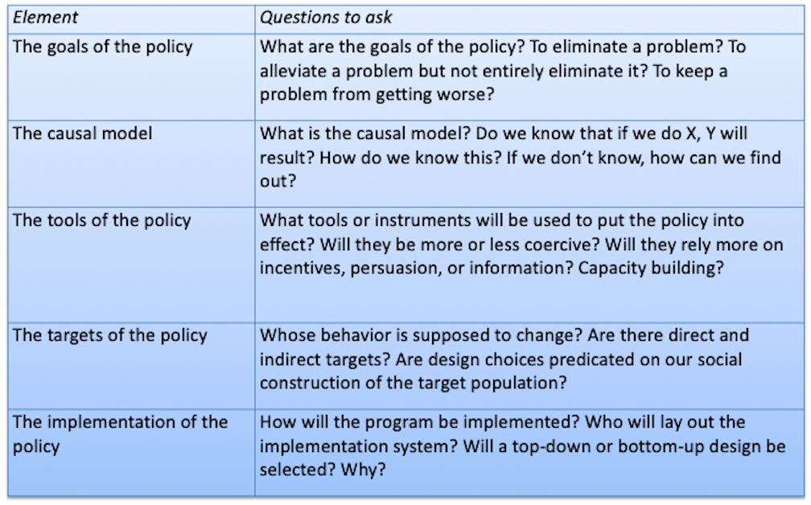

  
```{r setup, include=FALSE}
knitr::opts_chunk$set(warning = FALSE, message = FALSE, 
                      fig.retina = 3, fig.align = "center")
```

```{r xaringanExtra, echo=FALSE}
xaringanExtra::use_webcam()
```

.pull-left[
# Policy <br> Design

<figure>
  
</figure>
]

.pull-right[

</br>
</br>
</br>
**POLI 211: Introduction to Public Policy**

**Fall 2021**

.light[Matthew Nowlin, PhD<br>
Department of Political Science<br>
College of Charleston
]

]

---

class: center, middle

# What is policy design? 

---

class: title title-1 

# Policy Design 

> **The process by which policies are designed, both through technical analysis and through the political process, to achieve a particular goal** 

-*Birkland* pg 307

--

* The culmination of getting from policy formulation $\rightarrow$ alternative selection $\rightarrow$ enactment  

--

* The _content_ of public policy: the **output** of the policymaking system  

---

class: title title-1

# Policymaking Frameworks 

<br>

.pull-left[
<figure>
  
</figure>
]

.pull-right[
<br>
<figure>
  
</figure>
]


---

class: title title-1

# Policy Design and Implementation

--

**Policy design (alternative selection and enactment)** 
* Decision-making about which policy designs to adopt

--


**Policy implementation** 
* The process by which policies enacted by government are put into effect by the relevant agencies 

---

class: title title-1

# Policy Design and Implementation


**Choices made in design influence implementation** 

--

**Policy design continues during implementation** 
* Experience will change design
* Experience can change appreciation of problems

---

<iframe src="https://embed.polleverywhere.com/multiple_choice_polls/q80P8lG1cRjNnoGr5BNDc?controls=none&short_poll=true" width="800px" height="600px"></iframe>

???
quiz q
---

class: title title-1

# Designing Public Policy: Problems 

**How do we know we need a policy?**

--

**Something we can do something about** 

* Is something a problem? Or is it a condition about which we can do little?
* Is there a _market failure_? 

---

class: title title-1

# Designing Public Policy: Problems 

**How do we know we need a policy?**


**We learn about problems through...**
* Changes in indicators of problems
* Sudden, harmful, or frightening focusing events

--

**Problems are not obvious and self-evident** 

* Problem definition is contested
* Problem definition shapes the solutions to problems


---

class: title title-1

# Elements of Policy Design 

<figure>
<center>
  
</figure>

???
birkland pg 308
---

class: title title-1

# Policy Goals 

**What we want the policy to achieve** 

--

**Categories of policy goals**  

--

* Efficiency
  * Ratio of output to input

--

* Equity 
  * What does equity mean? How do we know when we have it? 

---

class: title title-1

# Policy Goals 

**What we want the policy to achieve** 

--

**Categories of policy goals**  


* Security and liberty 
  * Are these in conflict? 

--

* Positive and negative liberty 

---

class: title title-1

# Causal Theory 

> **A theory about what causes problem and how particular responses would alleviate the problem** 

-_Birkland_ pg 315

--

**What _causes_ outcome _Y_?**  

**How does policy _X_ impact outcome _Y_?**  

---

class: title title-1

# Causal Theory 

**Causal theory shapes policy tools** 
* The concern of agencies and professionals
* Sometimes implicit in statutory design
* _The nature of the market failure_  

--

**Poor causal theory can yield policy failure** 
* What if the causal theory is _wrong_?
* Problems are complex 

---

class: center middle

# Example: Teen pregnancy

---

<iframe src="https://embed.polleverywhere.com/multiple_choice_polls/okum64NAd3wPFaZil4BeB?controls=none&short_poll=true" width="800px" height="600px"></iframe>

???
quiz q
---

class: title title-1

# Policy Tools (Instruments) 

## The means of achieving policy goals

**Carrots, Sticks, and Sermons **

--

**Carrots**: Provide incentives for desired behavior 

--

**Sticks**: Require or prevent desired behavior 
* Regulations

--

**Sermons**: Provide information to persuade targets to perform (or not) desired (undesired) behavior 

---

class: title title-1

# Policy Tools (Instruments) 

**Market-based approaches** 
* Using markets 
  * Adjusting prices through taxes and subsidies 

--

* Creating markets 
  * Create property rights 

---

class: title title-1

# Policy Tools (Instruments) 


**Engaging the public** 
* Require information disclosure 
* Stakeholder engagement 
    

---

class: title title-1

# Market Failures and Policy Tools

.small[
.pull-left[
**Insufficient competition**  
* _Monopoly_

**Asymmetric information**
* _Used cars_

**Negative externalities** 
* Social cost $>$ Private cost
]
]

--

.small[
.pull-right[
**Regulation (Stick)** 
* _Anti-trust_

**Provide information (Sermon)** 
* _NHTSA provides crash test information_ 

**Market-based approach (Carrots)**
* _Tax, where PC + Tax = SC_ 
]
]

---

class: title title-1

# Dimensions of Policy Tools

<figure>
<center>
  
</figure>

???
birkland pg 325-326
---

class: title title-1

# Tools and Choices in Policy Design

--

**Technically sound design does not trump politics** 

--

**Tools choice is constrained by resources** 

--

**Tools are based on behavioral assumptions about policy targets** 

* Targets: entities whose behavior policy will alter
* Affects choices about, for example, more or less coercive policies

--

**Multiple policy tools are used to achieve goals** 


