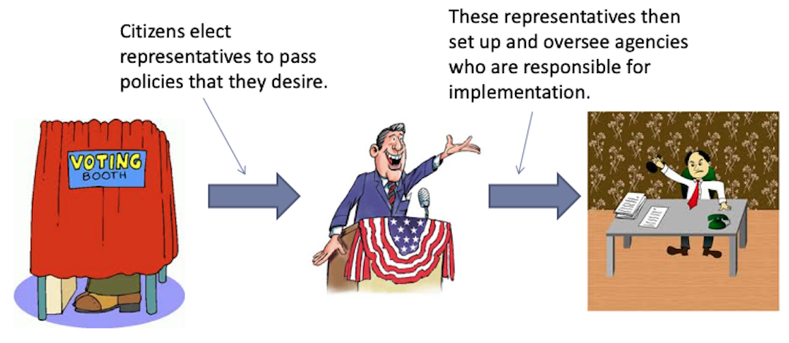

  
```{r setup, include=FALSE}
knitr::opts_chunk$set(warning = FALSE, message = FALSE, 
                      fig.retina = 3, fig.align = "center")
```

```{r xaringanExtra, echo=FALSE}
xaringanExtra::use_webcam()
```

.pull-left[
# Policy <br> Implementation

<figure>
  
</figure>
]

.pull-right[

</br>
</br>
</br>
**POLI 211: Introduction to Public Policy**

**Fall 2021**

.light[Matthew Nowlin, PhD<br>
Department of Political Science<br>
College of Charleston
]

]

---

class: center, middle

# Policy has been enacted, so now what? 

---

<iframe src="https://embed.polleverywhere.com/multiple_choice_polls/awQpx6kqbRbgfcmEfjFRM?controls=none&short_poll=true" width="800px" height="600px"></iframe>

???
quiz q
---

class: title title-1

# Policy Implementation 

--

</br>

> **The process by which policies enacted by government are put into effect by the relevant agencies** 

-*Birkland* pg. 343

---

class: title title-1

# Policy Implementation 

**Remember, _policy design and implementation are not separate_** 

--

**Legislative intent is often unclear** 
* Why would Congress write vague legislation? 

--

**Bureaucracies have discretion** 
* Politics - Administration dichotomy

---

class: title title-1

# Policy Implementation 

**Politics - Administration dichotomy**

--

.pull-left[
**Politics** 

* Decides what actions should be taken through debate 

* _Values based_

]

--

.pull-right[
**Administration** 

* Implements policies made by elected officials 

* _Expertise based_
]

---

class: title title-1

# Policy Implementation 

**Authority and Accountability** 

--

<figure>
<center>
  
</figure>

---

class: title title-1

# Policy Implementation 

**Not so clear cut** 

--

* _Agencies make policy through implementation_ 

--

* _Implementation battles are also where significant power and debate come in_

--

* _Pre-enactment opposition becomes post-implementation conflict_

---

class: center, middle 

# Policy implementation: Top-down vs bottom-up

---

class: title title-1

# Top-Down Approach 

<br>

> **A way of studying policy design and implementation that considers the goals of the highest-level policy designers and traces the design and implementation of the policy through the lowest-level implementers**  

-*Birkland* pg. 347

---

class: title title-1

# Top-Down Approach 

**Design starts at the top—highest-level policy designers** 

--

**Assumes** 

--

* Clear goals

--

* Clear tools

--

* Single statute or other authority

--

* Clear implementation chain

--

* Knowledge of capacity and commitment of implementers

???
**Are these assumptions realistic**?
---

class: title title-1

# Top-Down Approach 

**Issues** 

--

**Does not account for federalism** 
* Feds can set guidelines better than hard rules
* Local officials can engage in _strategic delay_ 

--

**Most policies are based in multiple statutes** 

---

class: title title-1

# Top-Down Approach 

**Issues** 

**But, the feds can ...**
* Impose roles on who implements
* Apply incentives and sanctions to promote a particular design

---

<iframe src="https://embed.polleverywhere.com/multiple_choice_polls/3MbJ6pWZIogMgeJXUnqnS?controls=none&short_poll=true" width="800px" height="600px"></iframe>

???
quiz q
---

class: title title-1

# Bottom-Up Approach 

<br>

> **A way of studying policy design and implementation that considers the abilities and motivations of the lowest-level implementers, and tracks policy design from that level to the highest levels of government** 

-*Birkland* pg. 349 

---

class: title title-1

# Bottom-Up Approach 

**Start from perspective of _street-level bureaucrats_** 

--

**Assumes** 

--

* Policy goals are ambiguous 

--

* More than a single statute or “policy”

--

* A _network_ of implementation actors


???
**Are these assumptions realistic**? 

---

class: title title-1

# Bottom-Up Approach

**Issues** 

--

**Overemphasizes street-level bureaucrats’ discretion** 
* Top levels can impose sanctions
* Street-level may _want_ to follow the lead of the top-level designers

--

**Assumes that interest groups are always active participants** 

* Policies without publics—low mobilization
* Target groups often lack influence, power

---

class: title title-1

# Synthesis: Top-Down and Bottom-Up 

**Implementation is communication between policy makers and implementers**

--

**Requirements for successful implementation** 

--

* Clear messages from credible officials $\rightarrow$ receptive implementers 

--

* Implementers are given sufficient resources 

--

* Support from affected groups 

--

* Discretion can lead to innovation and learning 

---

class: title title-1

# Who Implements Policy? 

**Implementation is a political _and_ technical process**  

--
* _The executive branch agencies_ 

--
* The president through executive orders 

--
* The legislative branch through oversight 

--
* The judicial branch through oversight 

--
* Other levels of government

--
* Private actors

--

**Basically everybody** 

---

<iframe src="https://embed.polleverywhere.com/multiple_choice_polls/ee122AzDrs8tFXaDRJs7Q?controls=none&short_poll=true" width="800px" height="600px"></iframe>

???
quiz q
---

class: title title-1

# Administrative Burden 

.pull-left[
**The costs incurred when interacting with government** 

**_Any context in which the state regulates private behavior or structures how individuals seek public services is a venue in which the state may impose burdens on its citizens_**
]

.pull-right[
<figure>
<center>
  
</figure>
]

---

class: title title-1

# Administrative Burden

**Types of Costs**

--

**Learning costs** 
* Costs that people encounter when they search for information about public services

--

**Compliance costs** 
* Cost of complying with rules and requirements

---

class: title title-1

# Administrative Burden: Types of Costs

**Types of Costs**

**Psychological costs**
* Stresses, loss of autonomy, or stigma

---

class: center, middle

# Why should we care about administrative burdens?  

???
have you encountered any administrative burdens? (here at college; poli sci advising)
---

class: title title-1 

# Administrative Burden 

**The presence of administrative burdens makes the difference as to whether government is experienced as accessible or opaque, simple or bewildering, respectful or antagonistic** 

--

**Burdens are**:

* Consequential
* Distributive
* Constructed

---

class: title title-1

# Administrative Burden 

**Burdens are consequential**

--

* **The costs citizens' bear influence citizens’ perceptions of government** 
  * _Taxes_ 

--

* **Burdens matter for whether we gain access to vital resources, such as education**
  * _Free Application for Federal Student Aid (FAFSA) form_ 

---

class: title title-1

# Administrative Burden 

**Burdens are consequential**

* **Burdens can, quite literally, determine who is and is not a member of society**
  * _Immigration_ 

---

class: title title-1

# Administrative Burden 

**Burdens are distributive** 

--

_Do administrative burdens hurt some more than others?_

--

**_Those who are least advantaged tend to face more administrative burdens, even though they have fewer resources to manage and overcome them_** 

--

**_Burdens reinforce inequalities in access to rights_**

???
Vote, reproductive care, benefits  
---

class: title title-1

# Administrative Burden 

**Burdens are distributive**

--

_Redistributive policies_

--

.pull-left[
**Universal programs** 
* Near 100 percent up-take 
]

--

.pull-right[
**Means-tested programs**
.small[
* SSI: 40 to 60 percent 
* SNAP: 65 percent 
* Unemployment: 30 to 60 percent 
* Medicaid: 50 to 70 percent 
* EITC: 80 percent 
* AFDC (77 to 86 percent) vs TANF (42 to 52 percent)
]
]

???
Takes (or seems to take) a resource from one identifiable group and gives a benefit to another readily identifiable group 
---

class: title title-1

# Administrative Burden 

**Burdens are distributive** 

--

**Resources matter in overcoming burdens** 

--

* College applications
  * Providing information and waiving application fees made low-income students 46 percent more likely to apply to college 
  * Providing assistance in completing the FASFA led to a 26 percent increase  

--

**For poor Americans the experience of government is the experience of burdens** 

---

class: title title-1

# Administrative Burden 

**Burdens are constructed** 

--

* Administrative burdens are the product of administrative and political choices

--

* Political actors often see burdens as a policy tool to achieve an ideological goal


---

class: title title-1

# Administrative Burden 

**Some degree of burden is necessary to prevent fraud** 

--

**Guidelines** 

* Citizens are better off when public programs are designed to be simple, accessible, and respectful of the citizens they encounter

--

* Burdens should be minimized to the greatest extent consistent with protecting important public values, such as cost and program integrity 

---

class: title title-1

# Administrative Burden 

**Some degree of burden is necessary to prevent fraud** 

**Guidelines** 

* Considerations of burden should be evidence based, identifying the multiple values involved and the likely effects of burdens on those values, and informed by logic and empirical evidence rather than by political rhetoric **or lies** 

---

class: title title-1

# Administrative Burden 

**Some degree of burden is necessary to prevent fraud** 

**Guidelines** 

* Because burdens can affect some groups more than others, we should be especially attentive to costs on those with limited resources or in programs that are specifically to help those with limited means

---

<iframe src="https://embed.polleverywhere.com/multiple_choice_polls/TdstoZpFWYwORWbycuyXz?controls=none&short_poll=true" width="800px" height="600px"></iframe>

???
quiz q
---

class: center, middle

background-image: url("https://media.giphy.com/media/WxzjsygSlVd0o6hamp/giphy.gif")
background-position: 50% 50%
background-size: 50%
class: top, fullscale

# Policy <br> Failure 


---

class: center, middle

# Why might policies "fail"? 

---

class: center, middle

# Policy failure: 

.left[
## _Is there an objective measure of success acceptable to all conflicting value positions_?
]

---

class: title title-1

# Policy Failure 

**Failure is difficult to define** 

--
* Problems are connected to other problems

--
* Policies are interrelated 

--
* Excessive policy demand and expectations 

--
* Inaccurate causal model

--
* Counter-factual: _What would have happened with no policy?_ 

---

class: title title-1 

# Policy Learning 

**What do we mean by learning?** 

--

**Learning** : 

* Changing behavior in response to feedback 

--

* Accumulating information for decision-making

--

* Sharpening skills to help do particular tasks better

---

class: title title-1 

# Policy Learning 

**Types of policy learning**

--

**Instrumental learning** 

* Learning about the effectiveness of policy tools 

--

**Social learning**

* Learning about the social causes of problems 

---

class: title title-1 

# Policy Learning 

**Types of policy learning**


**Political learning** 

* Learning about better strategies for making political arguments 


