  
```{r setup, include=FALSE}
knitr::opts_chunk$set(warning = FALSE, message = FALSE, 
                      fig.retina = 3, fig.align = "center")
```

```{r xaringanExtra, echo=FALSE}
xaringanExtra::use_webcam()
```

.pull-left[
# Public <br> Budgeting

<figure>
  
</figure>
]

.pull-right[

</br>
</br>
</br>
**POLI 211: Introduction to Public Policy**

**Fall 2021**

.light[Matthew Nowlin, PhD<br>
Department of Political Science<br>
College of Charleston
]

]

---

class: center, middle 

# Why is budgeting important for public policy? 

---

<iframe src="https://embed.polleverywhere.com/multiple_choice_polls/32vMsn3Ek8E9g3BEWAsvx?controls=none&short_poll=true" width="800px" height="600px"></iframe>

???
quiz q
---

class: title title-1

# Budgeting 

</br>

> **Budgeting is, at its core, the fundamental decision about the use of scare resources from the people** 

—Kettl, _Politics of the Administrative Process_ pg 296 

???
more good idea than money; the people's money 
---

class: title title-1

# The Budget and Public Policy 

--

**Policy conflict continues in budgeting**

--

**Funding decisions can**: 
* Allow policies to succeed
* Cripple policies
* Nullify policies

---

class: title title-1

# The Budget and Public Policy 


**Some policies do not require funding** 
* Symbolic policies: e.g., _Defense of Marriage Act_

--

**Changes in government expenditures reflect changes in national priorities**
* _Great Society_ (1960s); _War on Terror_ 

---

class: title title-1

# The Budget and Public Policy 

**Funding decisions are typically incremental** 

<figure>
<center>
  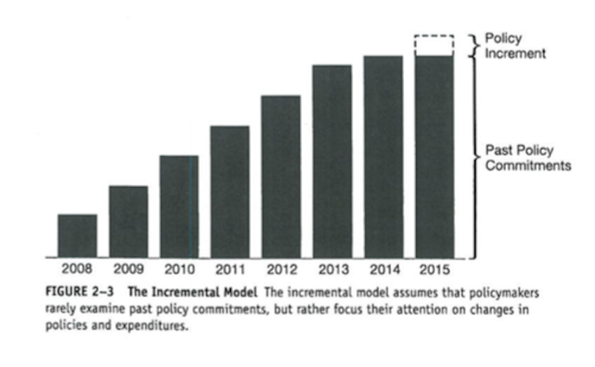
</figure>


---


class: title title-1

# Macro-Economic Policy 

**The use of policy to influence economic growth** 

--

**Fiscal policy** 

* _The deliberate use of the government's **taxing** and **spending** powers to stimulate or restrain the economy_ 

--

* Keynesian economic theory

--

* Made by Congress and the president through the budget process 

---

class: title title-1

# Macro-Economic Policy 

**The use of policy to influence economic growth** 


**Monetary policy** 

* _Manipulating the **interest rate** and **money supply** to influence the operation of the economy_ 

--

* Twin goals of economic growth and low _inflation_ 

--

* Made by the Federal Reserve Board which operates independent of Congress and the president 

---

<iframe src="https://embed.polleverywhere.com/multiple_choice_polls/kwYfHnihVLEMeksqNvOBK?controls=none&short_poll=true" width="800px" height="600px"></iframe>

???
quiz q
---
class: title title-1

# The Budget Process 

--

**Mandatory spending** 
* Federal spending that is spent based on existing laws _rather than the budgeting process_. 

--

**Discretionary spending** 
* The portion of the budget that the president requests and Congress appropriates every year. 

--

**Mandatory spending accounts for about 2/3 of federal spending** 

---

class: title title-1

# Mandatory Spending

<figure>
<center>
  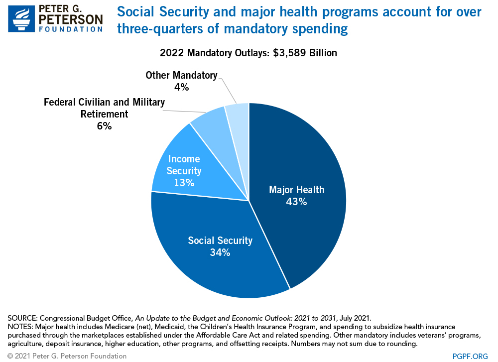
</figure>

???
Major Health Programs refers to four programs: Medicare (for seniors and disabled people); Medicaid (for low-income people); health insurance subsidies and related programs (for low- and moderate-income people); and the Children’s Health Insurance Program (for low-income children and parents).

Social Security provides payments to retired and disabled workers, as well as to their spouses, dependent children, and survivors.

Income Security Programs make payments to individuals based on their income through programs such as the following: earned income, child, and other tax credits (refundable tax credits for the working poor); the Supplemental Nutrition Assistance Program (formerly known as food stamps); Supplemental Security Income (payments to disabled children and adults with limited incomes); unemployment compensation (time-limited payments for people who become unemployed); family support and foster care; and child nutrition.

Federal Retirement Programs for federal civilian and military retirees.

Veterans’ Programs that provide pensions, income support, and other benefits for those who previously served in the military.

Other Programs consist of a diverse group of activities, including those that provide agricultural subsidies, student loan subsidies, healthcare benefits for retirees of the uniformed services, and deposit insurance.

Social Security and major health programs account for three-quarters of programmatic mandatory spending

source: https://www.pgpf.org/finding-solutions/understanding-the-budget/spending
---

class: title title-1

# Discretionary Spending

<figure>
<center>
  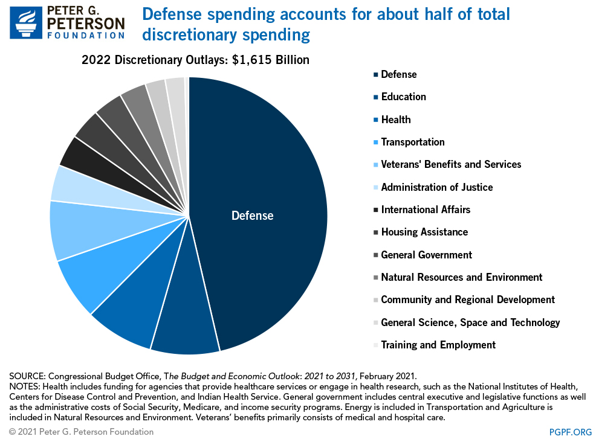
</figure>

---

class: title title-1

# Discretionary Spending

<figure>
<center>
  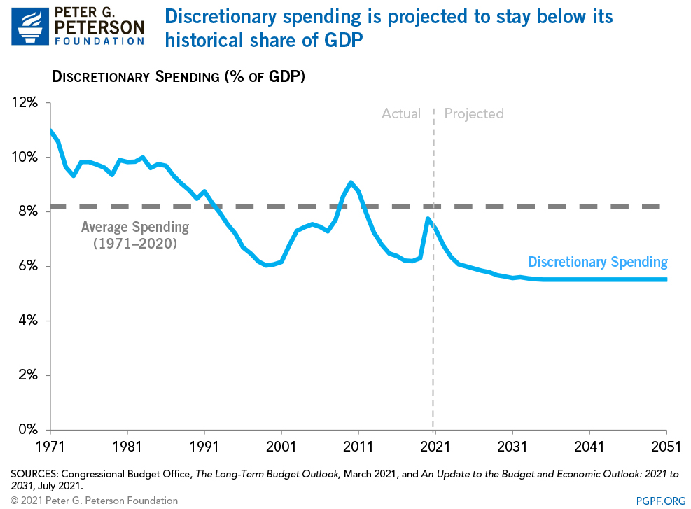
</figure>

---

class: title title-1

# Future Spending 

<figure>
<center>
  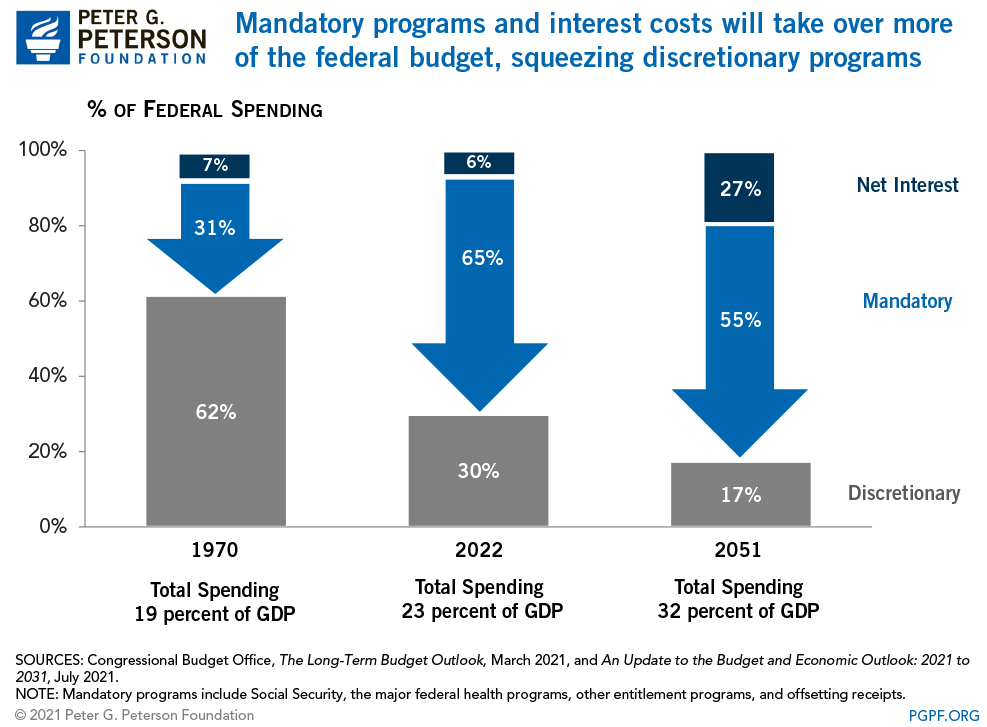
</figure>

---

class: title title-1

# The Budget Process 

**Executive preparation** 

<figure>
<center>
  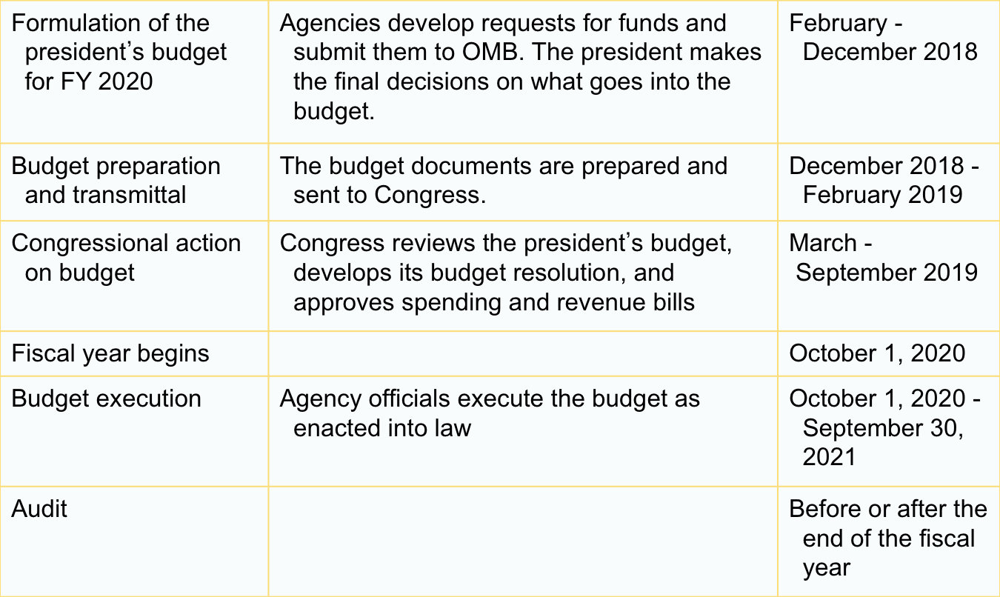
</figure>

---

class: title title-1

# The Budget Process 

**Congressional authorization**

<figure>
<center>
  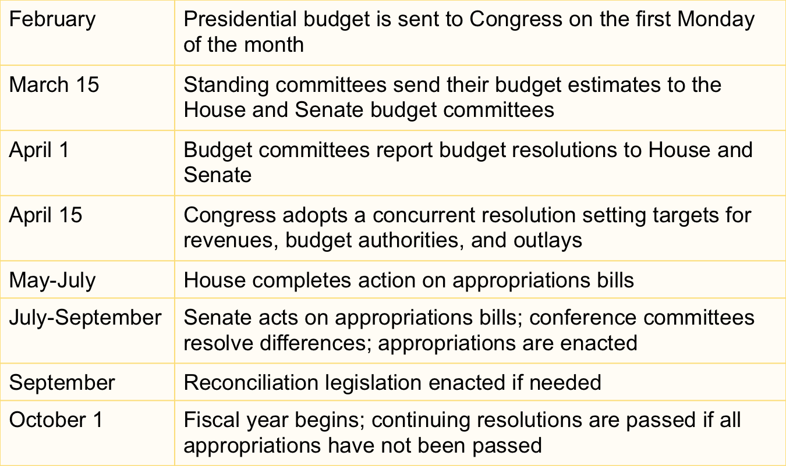
</figure>

---

class: title title-1

# The Budget Process 

**Reconciliation** 
* **Congressional Budget Resolution**: A concurrent resolution that outlines the budget plan 

--

* The budget resolution can include instructions for _reconciliation_, where one or more committees are instructed to recommend legislative changes to meet the direct spending and revenue levels included in the budget resolution

---

class: title title-1

# The Budget Process 

**Reconciliation** 
* Committee changes are combined into a big _reconciliation bill_  

--

* The reconciliation bill has to be related to spending or taxes; "_Byrd bath_"
  * The Senate parliamentarian decides 

--

* Debate times on the reconciliation bill are limited in the Senate 

--

* Passed by a simple majority in the Senate 

---

<iframe src="https://embed.polleverywhere.com/multiple_choice_polls/KQwOW2njWgC1YIoGcF6LF?controls=none&short_poll=true" width="800px" height="600px"></iframe>

???
quiz q
---

class: title title-1

# The Budget Process 

**Deficit** 

* The annual difference between government spending and government revenue

--

**Debt** 

* The total amount of money the U.S. government owes. It represents the accumulation of past deficits, minus surpluses
  * _Debt limit (or ceiling)_: the maximum amount of money that the U.S. Treasury can borrow

---

class: title title-1

# Budget Deficits 

<figure>
<center>
  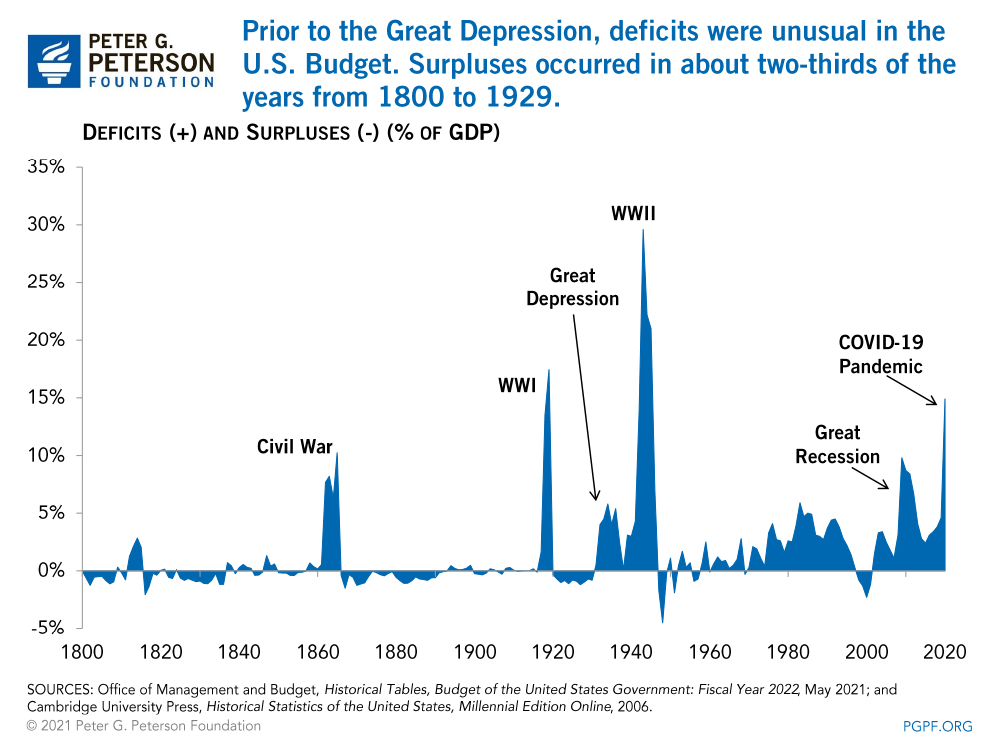
</figure>

---

class: title title-1

# The National Debt

**Total**

<figure>
<center>
  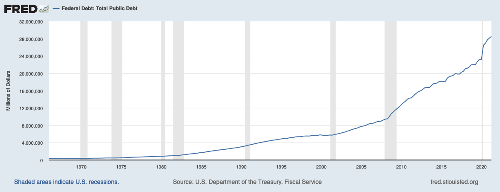
</figure>

---

class: title title-1

# The National Debt 

**As a percent of GDP** 

<figure>
<center>
  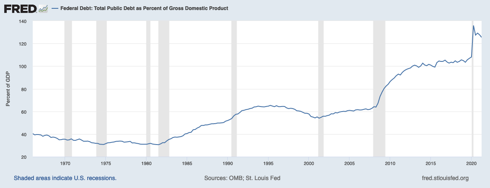
</figure>
---

class: title title-1

# The National Debt 

**Drivers of debt** 

--

* Demographics 

--

* Healthcare costs 

--

* _Lack of revenue_ 

---

<iframe src="https://embed.polleverywhere.com/multiple_choice_polls/xaApV290VnHN55EsGMDsT?controls=none&short_poll=true" width="800px" height="600px"></iframe>

???
quiz q
---

class: title title-1

# The Budget Process 

**Do tax cuts pay for themselves?**  

--

.pull-left[
**Supply-side economics**

* Tax cuts stimulate the economy 
* Past a certain tax rate, revenues decline

]


.pull-right[
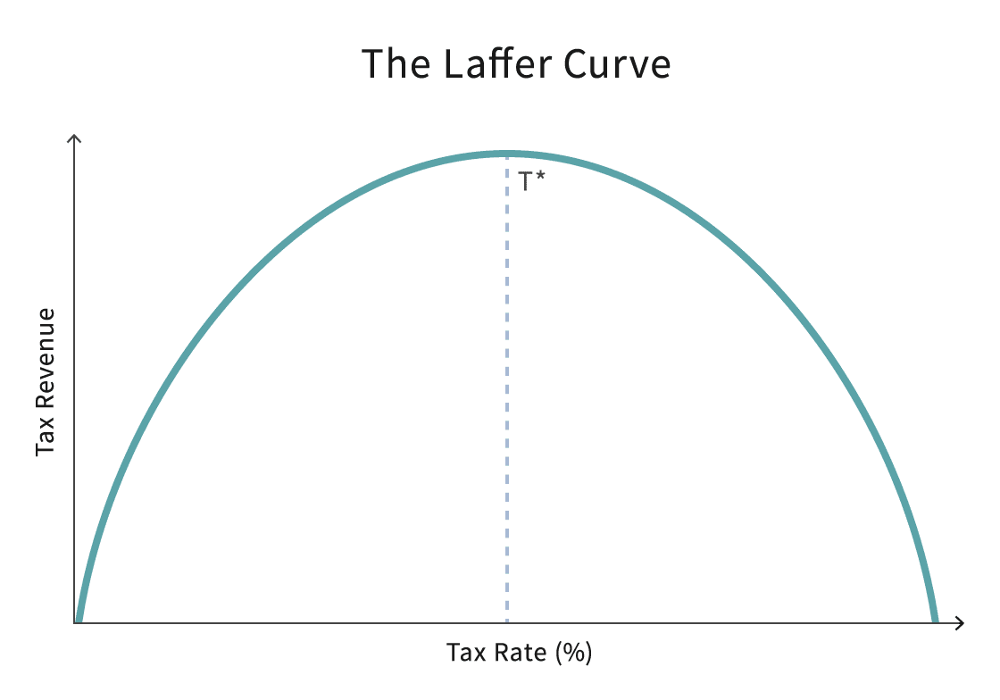
]

---

class: title title-1

# The Budget Process 

**Do tax cuts pay for themselves?**  

.center[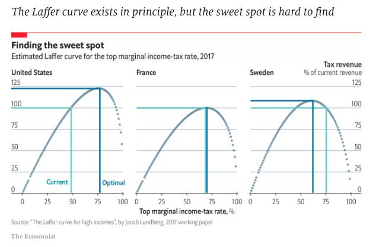]

---

class: title title-1

# The Budget Process 

**The Federal Debt: How worried should we be?**

--

**Right now, not too worried** 

* Low interest rates 

* Government is not having any problems borrowing 

* Little evidence of _crowding out_ 

---

class: title title-1

# The Budget Process 

**But...** 

* What are we paying for? tax cuts more than investments 
* Interest payments on the debt

--

**Bottom line...** 

* It's not a matter of _whether_ we will need to raise taxes and cut spending to address the debt, it's a matter of _when_ 


