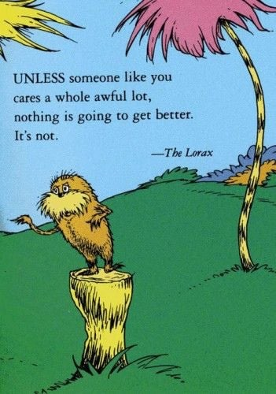

  
```{r setup, include=FALSE}
knitr::opts_chunk$set(warning = FALSE, message = FALSE, 
                      fig.retina = 3, fig.align = "center")
```


.pull-left[
# Policy Issues & <br> Conclusion


<figure>
  
</figure>
]

.pull-right[

</br>
</br>
</br>
**POLI 211: Introduction to Public Policy**

**Spring 2022**

.light[Matthew Nowlin, PhD<br>
Department of Political Science<br>
College of Charleston
]

]

---

class: title title-1

# Course Evaluations 

<figure>
<center>
  
</figure>

---

class: center, middle 

# Let's talk about your policy issues 

---

class: title title-1

# Policy Issues 

```{r issues barplot, include=FALSE, message=FALSE}
df <- data.frame(Issue=c("Abortion", "Criminal Justice", "Healthcare", "Climate Change", "Guns", "Child Welfare","Education"),
                 Count=c(7,6,4,3,3,2,2))

library(ggplot2)
p <- ggplot(data=df, aes(x=reorder(Issue, Count), y=Count)) +
  geom_bar(stat="identity") +
  theme_minimal() + xlab("") + ylab("")

p + coord_flip()


ggsave("img/issuesFall2021.jpg", device = "jpg")
```

.pull-left[
## Tell us about your policy issue 
]

.pull-right[
**Course concepts**
* Problems vs conditions 
* Environments (social, political, economic) 
* Institutions and actors
* Agenda setting 
* Policy formulation and design 
* Policy evaluation 
]

---

<iframe src="https://embed.polleverywhere.com/multiple_choice_polls/FpmVoZFIaqTWA6MD0mmFR?controls=none&short_poll=true" width="800px" height="600px"></iframe>

---

class: title title-1

# Course Overview 

.pull-left[
* Democracy and Public Policy
* The Context of Policymaking
* Policy Types
* Institutions
* Actors and Subsystems 
]

.pull-right[
* Policy stages
  * **Agenda Setting**
  * **Policy Formulation**
  * Decision-Making
  * Policy Analysis
  * **Policy Design**
  * **Policy Implementation** 
  * Public Budgeting
  * **Policy Evaluation**
]

---

class: center, middle

# A few final thoughts 

???
any thoughts on the class you are willing to share?
---

class: center, middle 

# Democracy is fragile 

???
institutions matter 
---

class: center, middle

# Public policy is (should be) about problem solving 

???
* a product of demand 
* but disagreements exist 
* why was your issue a matter of public concern? 
---

class: center, middle 

# Policymaking is a **process**. There is no clearly defined beginning, middle, and end 

---

class: center, middle

# Public policy is complex 

???
* problems are complex; policymaking is complex 
* what was complex about your issue?
---

class: center, middle

# Ideologies are short-cuts for thinking 

???
* evidenced-based policymaking 
* don't let the perfect be the enemy of the good 
---

.pull-left[
<figure>
<center>
  
</figure>
]

.pull-right[
<figure>
<center>
  
</figure>
]

---

<iframe src="https://embed.polleverywhere.com/multiple_choice_polls/N5HsE3GMkprKagELSG0YN?controls=none&short_poll=true" width="800px" height="600px"></iframe>


