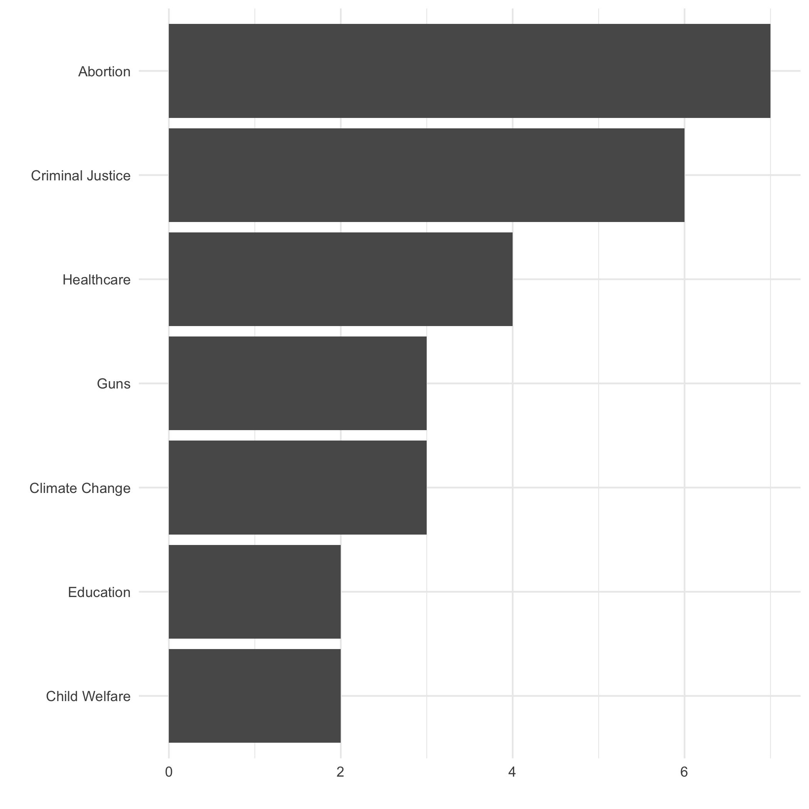

  
```{r setup, include=FALSE}
knitr::opts_chunk$set(warning = FALSE, message = FALSE, 
                      fig.retina = 3, fig.align = "center")
```

```{r xaringanExtra, echo=FALSE}
xaringanExtra::use_webcam()
```

.pull-left[
# Policy <br> Issues

<figure>
  
</figure>
]

.pull-right[

</br>
</br>
</br>
**POLI 211: Introduction to Public Policy**

**Fall 2021**

.light[Matthew Nowlin, PhD<br>
Department of Political Science<br>
College of Charleston
]

]

---

class: center, middle 

# Let's talk about your policy issues 

---

<iframe src="https://embed.polleverywhere.com/multiple_choice_polls/LlIp6W1pvOCFu1nviF3LD?controls=none&short_poll=true" width="800px" height="600px"></iframe>

???
quiz q
---

class: title title-1

# Policy Issues 

```{r issues barplot, include=FALSE, message=FALSE}
df <- data.frame(Issue=c("Abortion", "Criminal Justice", "Healthcare", "Climate Change", "Guns", "Child Welfare","Education"),
                 Count=c(7,6,4,3,3,2,2))

library(ggplot2)
p <- ggplot(data=df, aes(x=reorder(Issue, Count), y=Count)) +
  geom_bar(stat="identity") +
  theme_minimal() + xlab("") + ylab("")

p + coord_flip()


ggsave("img/issuesFall2021.jpg", device = "jpg")
```

.pull-left[
<figure>
  
</figure>
]

.pull-right[
**Course concepts**
* Problems vs conditions 
* Environments (social, political, economic) 
* Institutions and actors
* Agenda setting 
* Policy formulation and design 
* Policy evaluation 
]


